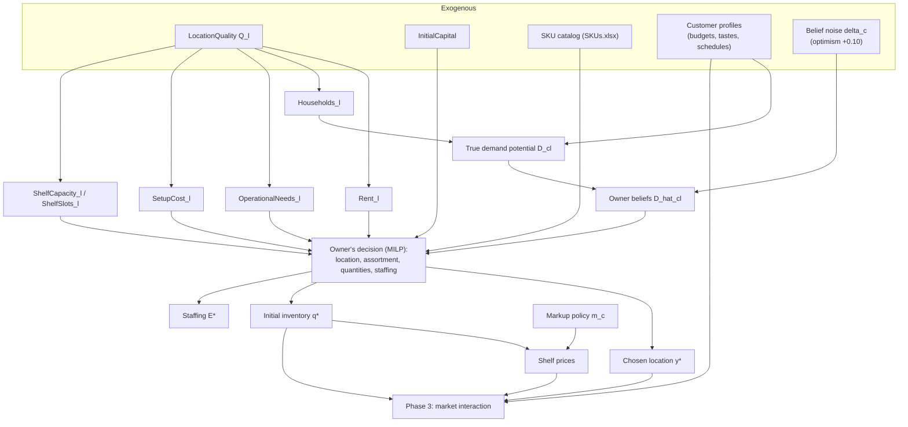

# Phase 1 Proposal — Building the World of the Store

Every business dataset is the residue of a world: people with habits and budgets, a street with rents and foot traffic, an owner with limited capital and imperfect information, all colliding day after day until the paperwork piles up. If we want to *generate* a realistic dataset, we cannot start from the paperwork — we must build the world first and let the paperwork fall out of it.

This document proposes Phase 1 of that construction: the world as it exists at $t = 0$, the moment before the store opens its doors. It is built bottom-up from both sides of the market. On the **demand side**, we start with a street, put households on it, turn households into customers with tastes and schedules, and give each customer a decision rule. On the **supply side**, we start with an entrepreneur, give him capital and beliefs, confront him with costs, and let him make his first — and biggest — decisions: where to open, what to stock, how much, and at what price.

The two sides do not yet touch. Their meeting — the daily market interaction that actually produces transactions — is Phase 3. Phase 2 adds the weather, the seasons, and the shocks. But everything those later phases need is defined here, so this document also specifies the interfaces they will consume.

**A note on notation.** Model statements follow McElreath's presentation: every distribution is written with its natural parameters and scale parameters are standard deviations — $\text{Normal}(\mu, \sigma)$, never $N(\mu, \sigma^2)$. Stochastic assignments use $\sim$, deterministic definitions use $=$, and where the causal direction itself is the point (the cost equations of Section 7), the assignment sign $\overset{\leftarrow}{=}$ marks the right-hand side as the *cause* of the left. Every distribution in this proposal was chosen by the same three-question discipline: What is the variable's *support* — bounded, positive, a share, a count? What *generative story* produces it — additive effects, multiplicative factors, independent trials? And given those constraints, what is the *least presumptive* (maximum-entropy) family? Each choice is defended where it appears, and the Appendix collects them all at a glance. Indices: locations $l \in L$, categories $c \in C$ (the 12 categories of `SKUs.xlsx`), SKUs $s \in S_c$ ($\approx 709$ in total), customers $i \in I$, periods $t$ (Phase 1 concerns $t = 0$ only). A hat ($\hat{\cdot}$) always marks a *belief* held by the owner, as opposed to the true value. All randomness flows from a single seeded `numpy.random.Generator`, so the entire world is reproducible from one integer.

---

## Part I — The Demand Side: A Street and Its People

### 1 The street

Before there are customers, there is geography. The neighborhood offers a handful of vacant premises — say eight — and they are not equal. Some sit on busy corners; some hide in quiet side streets. We compress everything that makes a location good into a single latent variable, $Q_l \in [0, 1]$, and let every observable feature of the location flow causally from it:

$$
\begin{align}
    Q_l &\sim \text{Beta}(2,\ 2) \\[4pt]
    \text{Households}_l &\sim \text{Normal}(\mu^{H}_l,\ 30), & \mu^{H}_l &= 250 + 400\,Q_l \\
    \text{Rent}_l &\sim \text{Normal}(\mu^{R}_l,\ 100), & \mu^{R}_l &= 500 + 1800\,Q_l \\
    \text{SetupCost}_l &\sim \text{Normal}(\mu^{S}_l,\ 400), & \mu^{S}_l &= 6000\,(1 - Q_l) \\[4pt]
    \text{OperationalNeeds}_l &= 1 + \lfloor 2.4\,Q_l \rfloor \\
    \text{ShelfCapacityUnits}_l &= \lfloor 6500 + 6500\,Q_l \rceil \\
    \text{ShelfSlots}_l &= \lfloor 150 + 250\,Q_l \rceil
\end{align}
$$

(Household counts are rounded to integers and setup costs truncated at zero after sampling.)

Two distributional choices deserve a defense before we read the equations economically:

* **Why $\text{Beta}(2, 2)$ for quality?** Quality is defined as a bounded score, so its distribution must live on $[0, 1]$ — the Beta family's home turf. The symmetric, gently domed $(2, 2)$ shape encodes what streets actually look like: most premises are middling, truly excellent and truly dreadful corners are rare, and none are mathematically perfect or hopeless (the density vanishes at both endpoints). A Uniform would instead claim that a flawless location is exactly as common as an average one.
* **Why Normal noise around the linear predictors?** Each residual collects the many small influences we chose not to model — building size, street layout, the landlord's temperament. When a mean and a finite spread are all we are willing to assume, the Normal is the maximum-entropy choice: it adds the least unwarranted structure beyond those two facts. The standard deviations are then set so the quality signal dominates without drowning the noise (quality moves households across a 400-unit range; the noise adds only $\pm 30$) and stay small relative to their means, so the post-hoc rounding and truncation almost never bind.

The reasoning behind each line tells a small story of its own:

* **Households** is the catchment — how many households live close enough to shop here. It is the causal bridge from geography to demand, and it is *why* good locations charge high rent. Rent and traffic share a common cause; neither causes the other.
* **SetupCost falls as quality rises**: the run-down premises with cheap rent need new wiring, shelving, refrigeration. This plants a *negative* correlation between two cost components in the data — a small trap for naive correlation analysis, and a clean classroom example of confounding by a common cause once the causal layer arrives.
* **OperationalNeeds** ($1$–$3$ staff) is the minimum staffing the location demands; **ShelfCapacityUnits** and **ShelfSlots** are the physical limits of the premises — total units it can hold, and how many *distinct* products fit on its shelves. Physical space, not only money, will constrain the owner. The capacity constants are sized against the demand calibration of Section 4 so that the owner's canonical $\approx 2.6$-week cover (Phase 3 §8) *just* fits a mid-quality location in an ordinary week — the shelf then binds exactly when it should: in each category's high season, where it produces the seasonally clustered stockouts the answer key expects. (An earlier draft's smaller constants made the shelf bind every single week, which quietly turned scarcity into an accidental inventory policy.)

### 2 The people

A street with $\text{Households}_l$ households does not hand the store that many customers; some will never come. The pool of potential regulars is

$$
N_l \sim \text{Binomial}(\text{Households}_l,\ 0.6).
$$

The Binomial is not a convenience here — it *is* the story: each household independently either adopts the store into its routine or does not, with a common probability. Count independent yes/no trials and the Binomial is the maximum-entropy result. Differences in *how much* each household shops are handled downstream by the profiles; only the *whether* is decided here.

Now the heart of the demand side: who are these people? Each customer $i$ is a bundle of habits, means, and tastes — enough structure to behave believably for twelve simulated months, yet compact enough to fit in a table row.

**Means.** Weekly grocery budgets are right-skewed, as incomes are:

$$
B_i \sim \text{LogNormal}(\log 85,\ 0.35)
$$

so the median customer has €85 a week, with a realistic tail of larger households.

The LogNormal is the right shape for the same reason incomes are roughly log-normal: a budget is a *product* of factors — household size, income level, eating habits, stock-up tendencies — and multiplying many small positive factors yields a LogNormal, just as adding many small effects yields a Normal (the central limit theorem, run on the log scale). It also guarantees positivity for free, and its parameters stay interpretable: $e^{\mu} = 85$ is exactly the median, and $\sigma = 0.35$ places roughly 95 % of customers between €42 and €170 a week ($85 \cdot e^{\pm 2\sigma}$) — a plausible span from single students to large families.

**Rhythm.** People shop on schedules. Each customer has a primary shopping day, a tendency to stick to it, and a small itch for midweek top-ups:

$$
\begin{align}
    d_i &\sim \text{Categorical}(p_{\text{day}}), & p_{\text{day}} &= (\text{Sat: } 0.35,\ \text{Sun: } 0.25,\ \text{Fri: } 0.12,\ \text{others: } 0.07) \\
    \pi_i &\sim \text{Beta}(9,\ 1.5) & &\text{(schedule adherence, mean} \approx 0.86\text{)} \\
    p_i &\sim \text{Beta}(1.5,\ 12) & &\text{(per-day top-up probability on non-primary days)}
\end{align}
$$

The Categorical needs no defense — seven unordered day labels admit no other distribution, and its weights are read straight off common experience (weekends dominate). The two Betas do subtler work. Each models a *probability*, so its support must be $(0, 1)$, which is precisely what the Beta family is for; the parameters are then chosen for shape. Adherence $\text{Beta}(9, 1.5)$ piles its mass near 1 — habits mostly hold — while its long left tail admits a minority of erratic shoppers. The top-up rate $\text{Beta}(1.5, 12)$ piles its mass near 0 — most days bring no extra visit. And in both, the parameters exceed 1, so the density vanishes at the endpoints: nobody keeps their schedule *always*, and nobody tops up *every* day. No perfectly deterministic people live in this world.

**Tastes.** A weekly basket is a composition — shares of the budget across the 12 categories — so the natural model is a Dirichlet, with concentration $\alpha$ set to typical grocery basket shares:

$$
w_i \sim \text{Dirichlet}(\alpha).
$$

The Dirichlet is to compositions what the Beta is to single probabilities — indeed it *is* the Beta, generalized to twelve shares constrained to sum to one, which is exactly the support a basket composition demands. Its concentration vector does double duty: the *relative* sizes of the $\alpha_c$ set the average basket, so the population mean matches real grocery shares, while the *overall magnitude* $\sum_c \alpha_c$ is a realism dial for individuality. Small totals breed specialists (the household that seems to live on pet food and beer); large totals breed clones of the average shopper. Iteration 1 should start moderate and tune this against Phase 3 output.

Two further taste parameters will do most of the economic work. Price sensitivity varies across people:

$$
\beta_i \sim \text{LogNormal}(0,\ 0.4),
$$

and brand affinity $b_i \in (0,1)$ — the pull toward premium versus budget `brand_level` — is *deliberately correlated with budget*, because in reality the two travel together:

$$
b_i = \text{logistic}\!\left(0.6\, z_i + 0.8\, \nu_i\right), \qquad \nu_i \sim \text{Normal}(0,\ 1),
$$

where $z_i$ is the standardized $\log B_i$. This is a second planted correlation for the descriptive layer to find — and, unlike the rent–setup-cost trap, this one is a *direct* dependence, so the two make an instructive contrast.

Both taste distributions earn their place. Price sensitivity must be *strictly positive* — a negative $\beta_i$ would describe a customer who prefers paying more, and every demand curve in this world must slope downward — and the LogNormal enforces positivity while anchoring the median at $e^{0} = 1$, which pins down the scale of the whole utility function; its right tail supplies the minority of fierce bargain-hunters who will later make promotion responses interesting. Brand affinity uses a standard latent-Gaussian device: build the trait on an unbounded scale, where correlation is easy to control, then squash it into $(0, 1)$ with the logistic. The loadings are not arbitrary either — since $0.6^2 + 0.8^2 = 1$, the latent score stays standardized and the budget loading *is* the latent correlation: exactly $0.6$, by construction.

**The wallet.** Finally, payment behavior, which quietly decides what the analyst will ever be able to see:

$$
\begin{align}
    T_i &\sim \text{Bernoulli}(0.6) & &\text{(1 = card-preferring)} \\
    \text{PaysByCard}_{iv} &\sim \text{Bernoulli}\!\left(0.95\, T_i + 0.10\,(1 - T_i)\right) & &\text{(per visit } v\text{)}
\end{align}
$$

Card payments carry the customer's identity; cash payments are anonymous. This single mechanism gives the final dataset its realistic missing-data structure: customer-level analysis will be possible for only part of the transactions, exactly as in real retail.

Bernoulli is the only distribution a single binary event admits; the choice worth defending is the *two-stage* design. A single flat card rate across all visits would make payment method pure noise, uninformative about who is standing at the till. Giving each person a persistent type with rare exceptions makes payment a stable trait with occasional surprises — so the identities the analyst observes arrive in realistic, customer-shaped streaks rather than scattered at random.

Each customer also carries a small deviation probability ($0.05$) — the chance of acting out of character on any given decision — so that no profile is a perfectly clockwork machine.

### 3 How a customer decides

Habits and budgets say *when* a customer shops and *how much* they can spend. We still need the moment of choice: standing before a shelf of, say, fourteen pasta brands, which one lands in the basket — and when does none of them?

We give every customer a utility function over the SKUs of a category, plus an outside option (buy nothing here; buy elsewhere):

$$
\begin{align}
    \text{choice}_{ic} &\sim \text{Categorical}\!\left(\text{softmax}(U_{i s_1}, \ldots, U_{i s_K}, U_{i0})\right) \\[4pt]
    U_{is} &= \theta_{ic} + a_s + \gamma \left(1 - \left|\, b_i - \text{BrandLevel}_s \right|\right) - \beta_i\, \text{ShelfPrice}_s \\
    a_s &\sim \text{Normal}(0,\ 0.8) \\
    U_{i0} &= u_0
\end{align}
$$

where $\theta_{ic}$ is need intensity (driven by the basket weights $w_{ic}$ and time since the last purchase in category $c$), $\text{BrandLevel}_s \in [0,1]$ is mapped from the catalog's `brand_level`, and the softmax over utilities is the standard multinomial logit. The **appeal intercept** $a_s$ — added in the validation-pass realism amendments — is the thousand unmodeled reasons one pasta outsells its shelf-neighbor: packaging, familiarity, taste. A Normal is the maxent choice given only a scale, and $\sigma = 0.8$ spreads within-category shares wide enough that realistic *dead stock* exists (a few SKUs that barely turn all year — a fixture of every real assortment). Nobody in the story observes $a_s$: not the owner (his flat $\rho$ belief is precisely his ignorance of it), not the analyst — though the conjoint layer may estimate it, and be graded.

The softmax is not decoration, and it is worth seeing why it is the principled choice. Add an independent Gumbel-distributed error to each utility and let the customer pick their noisy favorite: the resulting choice probabilities are *exactly* this softmax (McFadden's random-utility theorem). So the smooth formula and the human story — a shopper with tastes, on a given day, leaning one way or another — are one and the same model. It is also precisely the model that discrete-choice analysts fit in practice, which means the later conjoint analysis grades like against like: the analyst estimates the very functional form that generated the data, and only the parameters are at stake. The logit's known weakness — the independence of irrelevant alternatives — is tolerable *within* a single grocery category, and can be revisited (nested logit) if Phase 3 reveals implausible substitution patterns.

This is the single most load-bearing object in the whole design, because one small structure yields, for free:

* **downward-sloping demand** — raise a price and its choice probability falls, at a rate governed by each customer's own $\beta_i$;
* **substitution** — a price rise on one SKU pushes probability onto its neighbors, most strongly onto those with similar brand level;
* **budget discipline** — choices are made list-item by list-item until the weekly budget binds;
* **hidden demand** — when a chosen SKU is out of stock, the customer re-evaluates without it; the *original* choice is logged as latent truth that never appears in the sales data;
* **promotion response** — a discount is just a price change, so marketing effects need no separate machinery;
* **recoverable preferences** — an analyst with card-linked purchase histories can attempt to estimate $\gamma$ and the $\beta_i$ by discrete-choice (conjoint-style) methods, and their estimates can be graded against the true parameters.

Phase 1 defines and stores these parameters. It samples no purchases — that is Phase 3's job.

### 4 From people to demand potential

The owner will never meet the customers one by one before opening; neither should his decision problem. What matters at $t = 0$ is the aggregate: how much of category $c$ does the neighborhood around location $l$ consume in a month? With $\mu_c$ the mean monthly per-household consumption of category $c$ (in units, consistent with the Dirichlet basket shares above), the **true demand potential** is

$$
D_{cl} = \text{Households}_l \cdot \mu_c .
$$

One definitional guardrail, because everything downstream leans on it: $\mu_c$ is the mean monthly per-household purchasing of category $c$ **addressable by a store of this kind** — it already nets out the households that never adopt the store (the Binomial's $0.6$) and the share of spend a neighborhood store realistically captures against supermarket competition (roughly $0.65$; Phase 3 calibrates to it). Were $\mu_c$ instead *total* household consumption, $D_{cl}$ would overstate what even a perfectly stocked store could sell by a factor of $\approx 2.5$, the owner's carefully built "+10% optimism" would silently become a +150% delusion, and the safety-stock constraint of Section 8 could demand more units than any shelf holds. Addressable demand keeps $D_{cl}$ equal to what the store *would* sell if never out of stock — which is exactly the baseline the oracle comparisons need.

This is a ground-truth quantity. No one in the story observes it — least of all the owner, which is where the supply side begins.

---

## Part II — The Supply Side: An Owner and His Beliefs

### 5 The owner

Enter the entrepreneur: **€40,000** of initial capital, no store yet, and three standing policies — the simple rules of thumb every small-business owner runs on:

1. **Opening hours**: 12 hours a day, every day, so $H_0 = 360$ hours in the setup month. Hours are a *policy*, decided by lifestyle and habit, not re-optimized on a spreadsheet — which is also precisely what keeps the decision model of Section 8 linear.
2. **Markup rule**: a fixed markup per category, $m_c \in [0.20,\ 0.45]$ — low on perishables, high on household goods — applied uniformly to every SKU: $\text{ShelfPrice}_s = (1 + m_c)\,\text{SKUUnitCost}_s$. Pricing by rule, not by elasticity.
3. **Safety stock**: always keep at least a fraction $\eta = 0.3$ of a month's *expected* category demand on the shelf: $\text{MinInventory}_{cl} = \lceil \eta\, \hat{D}_{cl} \rceil$. Note the hat — the rule runs on his beliefs, and beliefs are the next section.

Each policy is sensible, common in practice, and quietly suboptimal. That is intentional: every rule of thumb here is a door left open for the analyst to walk through later.

### 6 What the owner believes

The owner cannot observe $D_{cl}$. He does what any of us would do: he walks the streets, counts foot traffic, talks to neighbors, and forms an estimate. We model his estimate as the truth seen through a noisy, slightly rose-tinted lens:

$$
\begin{align}
    \hat{D}_{cl} &= D_{cl}\, e^{\delta_c} \\
    \delta_c &\sim \text{Normal}(0.10,\ 0.25)
\end{align}
$$

The error lives on the *log* scale because people misjudge in ratios, not in units: nobody thinks "I am off by 37 boxes," they think "demand is probably a fifth higher than it looks." Exponentiating a Normal error makes the belief LogNormal around the truth — multiplicative, and automatically positive, as a demand estimate must be. The scale $\sigma = 0.25$ says his category estimates are typically off by about ±25 % and occasionally by half — about right for a person eyeballing a neighborhood.

The positive mean of $\delta_c$ makes him mildly over-optimistic on average — new business owners usually are — so he will tend to **overstock**, and the surplus will sit in storage costing money. The overstocking in the eventual dataset is thus not injected noise; it is the causal consequence of a believable psychological mechanism, and its size can be computed exactly from $\delta_c$.

One more belief rounds out his mental model: he does not expect any single product to dominate its category. Customers differ, he reasons, so no SKU should capture more than a share $\rho = 0.05$ of category demand — a twentieth, which is what category-share tables in real grocery data actually look like (leading SKUs run 3–10%). This intuition — correct in spirit, crude in its flatness — is what will push him toward stocking a *variety* of products rather than betting everything on one, and its value is not arbitrary: numerical audit of the decision model showed that a looser cap (an earlier draft used $0.25$) lets the capital-constrained optimum collapse to a couple of premium SKUs per category, an assortment no real shop would dare open with.

Everything the owner decides from here on is *internally consistent given his beliefs*. He is not irrational; he is rational about the wrong numbers. The distance between $\hat{D}$ and $D$ is the seed from which the entire "value of analytics" story will grow.

### 7 The costs of doing business

Before the decision, the bill. The cost structure at $t = 0$, written as a structural causal model (the sign $\overset{\leftarrow}{=}$ reads "is caused by"):

$$
\begin{align}
    \text{TotalCost}_0 &\overset{\leftarrow}{=} \text{FixedCost}_0 + \text{VariableCost}_0 \\
    \text{FixedCost}_0 &\overset{\leftarrow}{=} \text{Rent}_0 + \text{SetupCost}_0 \\
    \text{VariableCost}_0 &\overset{\leftarrow}{=} \text{InventoryManagementCost}_0 + \text{OverheadCost}_0 + \text{UtilityCost}_0 + \text{ListingCost}_0 \\
    \text{InventoryManagementCost}_0 &\overset{\leftarrow}{=} \text{RestockCost}_0 + \text{StorageCost}_0 \\
    \text{RestockCost}_0 &\overset{\leftarrow}{=} \textstyle\sum_s q_s\, \text{SKUUnitCost}_s \\
    \text{StorageCost}_0 &\overset{\leftarrow}{=} \left(\text{InitialInventory}_0 + \textstyle\sum_s q_s \right) \text{UnitStorageCost}_0 \\
    \text{ListingCost}_0 &\overset{\leftarrow}{=} F \cdot \textstyle\sum_s x_s \\
    \text{OverheadCost}_0 &\overset{\leftarrow}{=} E^{h}_0 \cdot \text{HourlySalaryRate}_0 \cdot H_0 \\
    \text{UtilityCost}_0 &\overset{\leftarrow}{=} H_0 \cdot \text{HourlyUtilityRate}_0 \\
    \text{Rent}_0,\ \text{SetupCost}_0,\ \text{OperationalNeeds}_0 &\overset{\leftarrow}{=} \textstyle\sum_l y_l \cdot (\text{feature of location } l)
\end{align}
$$

with $\text{InitialInventory}_0 = 0$ (the store starts empty), and where $q_s \geq 0$ is the quantity of SKU $s$ purchased, $x_s \in \{0,1\}$ indicates that SKU $s$ is listed at all, $y_l \in \{0,1\}$ selects the location, and $E^{h}_0 \geq 0$ is the number of **hired** staff. The owner himself is the first pair of hands and draws no wage this month — sole proprietors pay themselves out of profit, not payroll. This is not a nicety but a solvency condition, established by numerical audit: charge the owner €14/h for his own twelve-hour days and every €40,000 opening plan the MILP can construct books a believed *loss*, which no entrepreneur would sign. The rates $\text{HourlySalaryRate}_0 = 14$ €/h, $\text{HourlyUtilityRate}_0 = 6$ €/h, and $\text{UnitStorageCost}_0 = 0.02$ €/unit are constants at $t = 0$; their stochastic evolution belongs to Phase 2.

The **listing cost** $F = 2.5$ € per stocked SKU deserves a word. Every distinct product carries a fixed administrative burden — a supplier relationship, an order line, a shelf label. It is a small cost, but it is what makes "which products?" a genuinely discrete question rather than an accounting afterthought: variety must pay for itself.

### 8 The decision

Now the two sides of Part I and Part II collide inside one head. The owner holds: a table of eight locations with their rents, setup costs, staffing needs and shelf space; a catalog of 709 SKUs with wholesale costs (`retail_base_price_EUR`); his demand beliefs $\hat{D}_{cl}$; his policies; and €40,000. He must choose *where* to open, *what* to list, *how much* of it to buy, and *how many* people to hire — all at once, because each choice constrains the others through capital and shelf space.

He does what a careful planner does: maximize the profit *he expects*, subject to the constraints he knows. Formally, a Mixed-Integer Linear Program.

**Decision variables.** $y_l \in \{0,1\}$ (location), $x_s \in \{0,1\}$ (listing), $q_s \geq 0$ (purchase quantity), $u_s \geq 0$ (units he *believes* he will sell this month), $E^{h}_0 \geq 0$ (hired staff, beyond himself).

**Objective — believed profit:**

$$
\max \;\; \underbrace{\sum_{c}\sum_{s \in S_c} (1 + m_c)\, \text{SKUUnitCost}_s \cdot u_s}_{\text{believed revenue}} \;-\; \text{TotalCost}_0
$$

**Constraints:**

$$
\begin{align}
    \textbf{(one location)} \quad & \textstyle\sum_l y_l = 1 \\
    \textbf{(can't sell what you don't stock)} \quad & u_s \leq q_s && \forall s \\
    \textbf{(believed category demand)} \quad & \textstyle\sum_{s \in S_c} u_s \leq \textstyle\sum_l y_l\, \hat{D}_{cl} && \forall c \\
    \textbf{(no SKU dominates)} \quad & u_s \leq \rho \textstyle\sum_l y_l\, \hat{D}_{cl}, \qquad q_s \leq \rho \textstyle\sum_l y_l\, \hat{D}_{cl} && \forall c,\ s \in S_c \\
    \textbf{(safety stock)} \quad & \textstyle\sum_{s \in S_c} q_s \geq \eta \textstyle\sum_l y_l\, \hat{D}_{cl} && \forall c \\
    \textbf{(shelf units)} \quad & \textstyle\sum_s q_s \leq \textstyle\sum_l y_l\, \text{ShelfCapacityUnits}_l \\
    \textbf{(shelf slots)} \quad & \textstyle\sum_s x_s \leq \textstyle\sum_l y_l\, \text{ShelfSlots}_l \\
    \textbf{(listing linkage)} \quad & q_s \leq M_s\, x_s, \qquad M_s = \rho \max_l \hat{D}_{c(s),l} && \forall s \\
    \textbf{(staffing)} \quad & E^{h}_0 \geq \textstyle\sum_l y_l\, \text{OperationalNeeds}_l - 1 \\
    \textbf{(capital)} \quad & \text{TotalCost}_0 \leq \text{InitialCapital}_0 \\
    \textbf{(domains)} \quad & y_l, x_s \in \{0,1\}; \qquad q_s, u_s, E^{h}_0 \geq 0
\end{align}
$$

Every term is linear: products of a binary $y_l$ with a location *parameter* are linear, and because opening hours $H_0$ are policy rather than choice, the overhead term $E^{h}_0 \cdot \text{wage} \cdot H_0$ is linear in $E^{h}_0$. Two formulation details matter for the solver, both audit-tested. The no-dominance cap is applied to the *purchases* $q_s$ as well as the believed sales $u_s$ — faithful to the belief (he would not tie up capital in a product he is sure cannot sell through) and, incidentally, the constraint that makes the LP relaxation tight. And the big-M in the listing linkage, $M_s = \rho \max_l \hat{D}_{c(s),l}$, is the largest quantity the owner could ever stock of SKU $s$ under that cap.

It is worth pausing on how naturally this formulation behaves, because none of it is bolted on:

1. **Location becomes a true trade-off.** High-$Q$ locations cost more in rent but promise more in $\hat{D}_{cl}$ through their household counts. The owner weighs traffic against rent exactly as a real entrepreneur does.
2. **Variety emerges from beliefs.** The share cap $\rho$ means filling a category's believed demand takes at least $\lceil 1/\rho \rceil = 20$ SKUs; the listing cost $F$ and the shelf slots stop him short of listing everything. The breadth obeys a one-line identity worth knowing: if capital and shelf let him serve a fraction $\varphi$ of believed demand, he lists $\approx \lceil \varphi/\rho \rceil$ SKUs per category — the assortment is an *equilibrium* of beliefs, capital, and shelf, not a hand-set number.
3. **Overstocking is causal.** Optimistic beliefs inflate $\hat{D}$; the safety-stock rule stacks $\eta \hat{D}$ on top; the surplus pays storage. When the analyst later finds bloated inventory in the cost sheets, there will be a true mechanism behind it, traceable to $\delta_c$.
4. **It computes — with one proviso.** Eight location binaries, 709 listing binaries, ~1,500 continuous variables: with the purchase-side no-dominance cap in place, CBC reaches a solution within a 0.5% optimality gap in about a second (audit-tested against the real catalog). The proviso: demanding an *exact* optimality proof can stall for minutes, because near-identical SKUs make the branch-and-bound tree massively symmetric. Solve with a small relative gap (`gapRel=0.005`); at this scale the forgone euros are pocket change and the owner is not that precise a man anyway.

**The last step — prices.** With the location and quantities fixed, the owner walks the aisles with a label gun and his markup rule:

$$
\text{ShelfPrice}_s = \text{charm}\!\big((1 + m_c)\, \text{SKUUnitCost}_s\big) \qquad \forall s:\ x_s^{*} = 1,
$$

where $\text{charm}(p)$ snaps to each SKU's *habitual* psychological ending, fixed at listing time: most tags end $.x9$ (nearest ten cents, minus one), a few live on $.x5$, a few on round dimes — drawn once per SKU at $(0.86, 0.09, 0.05)$, because no grocer prices a jar at €4.87 but a real price list is not uniformly $.99$ either (a 2026-07-14 realism amendment: a *100%* charm share is itself a forensic tell). The charm grid, a validation-pass amendment, buys a second realism for free: prices become *sticky*, moving only when a cost change is large enough to cross to the next ending — exactly how shelf prices behave in the wild. He never asks which products *could bear* a higher price — his rule is blind to the $\beta_i$ of Section 2. One more open door.

---

## Part III — The World, Assembled

### 9 The causal graph

The whole of Phase 1 in one picture (renderable in the notebook with `mo.mermaid(...)`, no extra dependency):



Everything upstream of the decision node is generative ground truth; the decision node and its descendants are the owner's boundedly rational responses. Phase 2 will attach stochastic parents (seasons, weather, shocks) to demand and to the cost rates; Phase 3 consumes the outputs along the bottom.

### 10 Why the owner will be wrong — and why that is the point

The owner's choices are coherent given what he believes and how he simplifies. But five of his inputs and rules diverge from the truth, and each divergence is a documented ground truth that a specific layer of the analysis can later detect, measure, and monetize:

| # | Hidden flaw | Mechanism | Discoverable by |
| --- | --- | --- | --- |
| 1 | Optimistic demand beliefs | $\hat{D}_{cl} = D_{cl}\, e^{\delta_c}$ with $\text{E}[\delta_c] = 0.10$ | descriptive (sell-through rates), predictive (forecast vs. stock) |
| 2 | Flat safety-stock rule | $\eta = 0.3$ for every category, every season | prescriptive (inventory optimization on estimated demand) |
| 3 | Demand-blind markups | one $m_c$ per category, ignoring the elasticities $\beta_i$ | prescriptive / MMM (price-response estimation) |
| 4 | Static beliefs | no anticipation of the seasonality Phase 2 introduces | predictive (forecasting), diagnostic |
| 5 | Flat share cap | $\rho = 0.05$ for all SKUs vs. truly heterogeneous tastes | conjoint / discrete-choice analysis |

Three profit numbers will eventually exist side by side: the profit the owner *believed* he would make (the MILP objective value), the profit he *realizes* (Phase 3), and the profit an oracle with true demand *could have made*. The gaps between them are the quantified value of analytics — arguably the single most persuasive number this entire project can produce.

### 11 What Phase 1 hands over

Phase 1 ends by writing two kinds of artifacts: the store's *paperwork* (what a real business would have, and what the analyst receives) and the *answer key* (ground truth and private beliefs, hidden from the analyst, used only to grade the analyses).

| Artifact | Key columns | Visibility |
| --- | --- | --- |
| `locations` | location_id, quality, rent, operational_needs, setup_cost, households, shelf_capacity_units, shelf_slots | quality and households **hidden**; the rest visible (they appear in contracts and invoices) |
| `location_category` | location_id, category, true_demand_potential, believed_demand, min_inventory | **hidden** (ground truth + private beliefs) |
| `customers` | customer_id, weekly_budget, primary_day, adherence, topup_rate, price_sensitivity, brand_affinity, card_preference, category weights | **hidden** (only card-linked *behavior* ever surfaces, in Phase 3) |
| `owner` | initial_capital, opening_hours, markup by category, eta, rho, seed | **hidden**, except what surfaces in cost sheets |
| `decision_t0` | chosen location; per-SKU: listed, restock_qty, believed_sales, shelf_price; staffing | quantities and prices visible (procurement log, price list); believed_sales **hidden** |
| `cost_sheet_t0` | rent, setup, restock, storage, wages, utilities, listing fees | visible |

### 12 Default parameters

Every constant in this proposal, in one dictionary — the single source of truth for the implementation, later exposed as interactive Marimo widgets:

```python
PHASE1_PARAMS = {
    "seed": 20260712,
    # --- The street (Section 1) ---
    "n_locations": 8,
    "quality_beta": (2.0, 2.0),
    "households": {"base": 250, "slope": 400, "sd": 30},
    "rent": {"base": 500.0, "slope": 1800.0, "sd": 100.0},
    "setup_cost": {"base": 6000.0, "sd": 400.0},   # scales with (1 - quality)
    "shelf_capacity_units": {"base": 6500, "slope": 6500},  # sized so 2.6-wk cover fits; binds in high season
    "shelf_slots": {"base": 150, "slope": 250},
    # --- The people (Sections 2-3) ---
    "customer_participation": 0.6,                  # Binomial share of households
    "weekly_budget_lognormal": {"mu": 4.4427, "sigma": 0.35},  # median 85 EUR
    "primary_day_weights": {
        "Mon": 0.07, "Tue": 0.07, "Wed": 0.07, "Thu": 0.07,
        "Fri": 0.12, "Sat": 0.35, "Sun": 0.25,
    },
    "adherence_beta": (9.0, 1.5),
    "topup_beta": (1.5, 12.0),
    "price_sensitivity_lognormal": {"mu": 0.0, "sigma": 0.4},
    "brand_budget_loading": 0.6,      # correlation driver: brand affinity ~ budget
    "card_preferring_share": 0.6,
    "p_card_given_type": {"card": 0.95, "cash": 0.10},
    "deviation_prob": 0.05,
    "utility_brand_weight_gamma": 1.0,              # calibrate in iteration 2
    "sku_appeal_sd": 0.8,          # latent per-SKU appeal (realism amendment)
    "charm_pricing": "per-SKU habitual ending: .x9 / .x5 / .x0 at (0.86, 0.09, 0.05)",
    # --- The owner (Sections 5-8) ---
    "initial_capital": 40_000.0,
    "opening_hours_per_day": 12,
    "period_days": 30,
    "hourly_salary_rate": 14.0,
    "hourly_utility_rate": 6.0,
    "unit_storage_cost": 0.02,
    "listing_cost_per_sku": 2.5,
    "belief_bias": 0.10,              # mean of delta_c -> systematic overstocking
    "belief_sd": 0.25,
    "sku_share_cap_rho": 0.05,     # audit-calibrated: 0.25 collapses the assortment
    "safety_stock_eta": 0.30,
    "markup_by_category": "12 values in [0.20, 0.45], set once category list is fixed",
}
```

### 13 Implementation plan

Proposed structure of the implementation notebook, mirroring the story:

1. `PHASE1_PARAMS` — the dictionary above
2. `load_skus()` — read and validate `SKUs.xlsx` (via `pandas` + `openpyxl`)
3. `gen_locations(rng, params)` — Section 1
4. `gen_demand_potential(locations, skus, params)`, `gen_owner_beliefs(rng, ...)` — Sections 4 and 6
5. `solve_owner_milp(...)` — Section 8, with PuLP + CBC
6. `gen_customers(rng, chosen_location, params)` — Sections 2–3, instantiated once the location is chosen (only the winning neighborhood needs individual people)
7. `set_prices(...)`, `export_artifacts(...)` — Sections 8 and 11

Generation uses NumPy end to end (`numpy.random.Generator`); PyMC enters only in the later *analysis* notebooks, where probabilistic inference belongs. Dependencies to add to `pyproject.toml`: `numpy`, `pandas`, `openpyxl`, `pulp`.

**Validation checklist**, run at the end of the notebook:

* the MILP solves to within a 0.5% relative gap in seconds (exact proof may stall on the near-symmetric catalog — that is CBC's problem, not the model's), with total spend $\leq$ capital
* feasibility preconditions hold before solving: $\eta \sum_c \hat{D}_{cl} \leq \text{ShelfCapacityUnits}_l$ for at least one location (the safety stock must physically fit), and the implied restock bill leaves headroom under the €40,000 — both are calibration constraints on $\mu_c$, checked programmatically
* the assortment lands in a plausible range ($\approx$ 100–250 SKUs, per the breadth identity $\lceil \varphi/\rho \rceil$ per category — the exact figure moves with the $\mu_c$ calibration; the reference implementation lists 128 at the self-consistent defaults)
* believed profit $> 0$ (no one opens a store they expect to lose money — achievable precisely because the owner's own labor is unpaid; see Section 7)
* across a sweep of seeds, the chosen location is *not* trivially the cheapest or the highest-quality one
* the same seed reproduces every artifact byte for byte

### 14 Open questions

1. Should the quantities $q_s$ be integer (a true MILP) or continuously relaxed and rounded? Rounding is simpler and the bias is negligible at grocery quantities — **proposed: relax and round**.
2. Are the per-household consumption rates $\mu_c$ and the Dirichlet concentration $\alpha$ calibrated from the category structure of `SKUs.xlsx`, or set by hand? **Proposed: a documented manual first pass**, refined once Phase 3 reveals how the aggregates play out.
3. Should the owner solve one joint MILP over all locations (as formulated) or compare eight per-location solutions? **Proposed: the joint form** — one model, one solve, cleaner code.

---

## Appendix — The Distribution Choices at a Glance

Three questions decided every distribution in this proposal, always in the same order: **support** (bounded? positive? a share? a count?), **generative story** (additive effects, multiplicative factors, independent trials?), and, within those constraints, **maximum entropy** (the least presumptive family that honors what we claimed to know — and nothing more).

| Variable | Distribution | Support argument | Story argument |
| --- | --- | --- | --- |
| Location quality $Q_l$ | $\text{Beta}(2, 2)$ | a bounded score on $[0,1]$ | most premises middling, extremes rare, perfection impossible (density $\to 0$ at endpoints) |
| Location feature residuals | $\text{Normal}(0, \sigma)$ | unbounded residual | sum of many small omitted influences; maxent given a mean and finite spread |
| Customer pool $N_l$ | $\text{Binomial}(n, 0.6)$ | a count out of $n$ households | independent adopt-or-ignore decisions at a common rate |
| Weekly budget $B_i$ | $\text{LogNormal}(\log 85, 0.35)$ | strictly positive, right-skewed | product of multiplicative factors (CLT on the log scale); $e^{\mu}$ = median, directly interpretable |
| Primary day $d_i$ | $\text{Categorical}(p_{\text{day}})$ | 7 unordered labels | the only distribution on a finite unordered set; weights from experience |
| Adherence $\pi_i$ | $\text{Beta}(9, 1.5)$ | a probability on $(0,1)$ | habits mostly hold; erratic minority in the tail; no one perfectly reliable |
| Top-up rate $p_i$ | $\text{Beta}(1.5, 12)$ | a probability on $(0,1)$ | rare events; mass near zero but no one at exactly zero |
| Basket shares $w_i$ | $\text{Dirichlet}(\alpha)$ | 12 shares summing to 1 (simplex) | the Beta generalized to compositions; $\alpha$ ratios = mean basket, $\sum \alpha$ = individuality dial |
| Price sensitivity $\beta_i$ | $\text{LogNormal}(0, 0.4)$ | strictly positive | demand curves must slope down for everyone; median 1 anchors the utility scale; right tail = bargain-hunters |
| Brand affinity $b_i$ | logistic of a std. Normal blend | $(0,1)$, correlated with budget | latent-Gaussian squash; loadings normalized ($0.6^2 + 0.8^2 = 1$) so the loading *is* the correlation |
| Payment type / per visit | $\text{Bernoulli} \times \text{Bernoulli}$ | binary events | persistent type + rare exceptions → identities surface in customer-shaped streaks, not at random |
| SKU choice | $\text{Categorical}(\text{softmax}(U))$ | finite choice set + outside option | Gumbel random utility $\equiv$ multinomial logit (McFadden); the same model the analyst will fit |
| SKU appeal $a_s$ | $\text{Normal}(0, 0.8)$ | unbounded utility intercept | the unmodeled residue of product desirability; maxent given a scale; the source of realistic dead stock |
| Belief error $\delta_c$ | $\text{Normal}(0.10, 0.25)$ on the log scale | multiplicative, keeps beliefs positive | people err in ratios; positive mean = entrepreneurial over-optimism, the causal seed of overstocking |
