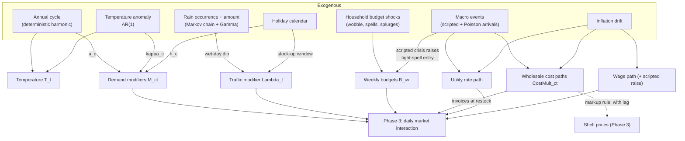

# Phase 2 Proposal — The Weather, the Seasons, and the Shocks

Phase 1 built the world at $t = 0$: a street, its people, an owner, and his first decisions. But that world is frozen — a photograph, not a film. Nothing in it yet explains why July is not January, why a rainy Tuesday empties the till, or why the wholesale price of frozen fish suddenly jumps in October. Phase 2 supplies the *motion*: the exogenous forces that push on the world from outside, day after day, for the twelve months the store will operate.

This document proposes that layer. It is best thought of as **the script of the year**, written before the play is performed. Every path defined here — each day's temperature, each millimeter of rain, each cost shock's arrival and decay, each household's tight month — is drawn once, from the same seeded generator as Phase 1, and stored. Phase 3 then performs the play: it reads the script and lets customers and owner act it out, hour by hour. Nothing in Phase 2 is a *reaction* to anything inside the simulation; that is precisely what makes these variables exogenous, and what will later make them so useful to the analyst — weather as a natural experiment, cost shocks as instruments, seasonality as the forecaster's prize and trap.

The phase has three jobs, mirroring the README's outline:

1. **Seasonal and weather effects on demand** — a calendar, a sky, and category-level demand modulation flowing from both.
2. **Supply shocks at the macro level** — wholesale cost paths and operating-rate paths, disturbed by rare, lumpy events.
3. **Idiosyncratic shocks at the individual level** — household budgets that breathe, wobble, and occasionally break.

**A note on notation.** All conventions carry over from Phase 1: distributions in McElreath style with standard deviations as scale parameters, $\sim$ for stochastic assignment, $=$ for definition, $\overset{\leftarrow}{=}$ where the causal direction is itself the claim. New indices: days $t \in \{1, \ldots, 365\}$, weeks $w \in \{1, \ldots, 52\}$, macro events $k$. Categories $c$ are the 12 of `SKUs.xlsx`; customers $i$ carry over from Phase 1. Every distribution again answers the same three questions — *support*, *generative story*, *maximum entropy* — and the Appendix collects the answers. All randomness flows from the same master seed as Phase 1, via a dedicated child stream (`spawn`ed from the master `SeedSequence`), so Phase 1 and Phase 2 are jointly reproducible yet independently re-runnable.

**A note on units.** Phase 1's demand potentials $D_{cl}$ were *monthly means*. Every multiplier defined in this document is normalized to average one over the year, so Phase 1's quantities keep their meaning: they are the annual baseline around which Phase 2 makes the world oscillate.

---

## Part I — The Calendar and the Sky

### 1 The calendar

The store opened one year before "today," so the simulated year is **2025-01-01 through 2025-12-31** — 365 days, chosen to align with the calendar year so that seasons, holidays, and the analyst's intuitions all line up. The calendar is deterministic and fully visible to the analyst: date, day-of-week, ISO week, month, a four-season label, and holiday flags.

Holidays are a small hand-set list appropriate to the store's implicit European setting: New Year's Day, Easter weekend (Good Friday through Easter Monday), May Day, a midsummer national day, Christmas Eve, Christmas Day, Boxing Day, and New Year's Eve. Two of them — **Christmas Day and New Year's Day — the store is closed**. This is the one amendment to Phase 1's "open every day" policy, and it is deliberate: two days of legitimately zero sales sit in the transaction data, waiting to trip up the first analyst who computes a daily average or fits a forecaster without checking the calendar. The closures are recorded in the visible calendar table; noticing them is the analyst's job.

Around each major holiday there is also a **pre-holiday window** — the three days before — when households stock up. The window matters more than the day: Christmas dinner is bought on the 22nd and 23rd, not the 25th.

One deliberate omission: **day-of-week effects do not live here.** Phase 1 already gave every customer a primary shopping day and an adherence habit; the weekend surge will *emerge* in Phase 3 from thousands of individual schedules. Adding a day-of-week multiplier on top would double-count the cause. Phase 2 only modulates what individuals cannot generate on their own: the annual cycle, the sky, and the shocks.

### 2 Temperature

Temperature is the workhorse of the weather layer — it drives the ice cream, the cold beer, and the winter soup. We model it as a deterministic annual cycle plus a persistent stochastic anomaly:

$$
\begin{align}
    T_t &= \mu_T(t) + \varepsilon_t \\[4pt]
    \mu_T(t) &= 12 + 9 \cos\!\left(\frac{2\pi (t - 200)}{365}\right) \\[4pt]
    \varepsilon_t &= \phi\, \varepsilon_{t-1} + \text{Normal}(0,\ \sigma_\varepsilon), \qquad \phi = 0.7,\ \ \sigma_\varepsilon = 2.0
\end{align}
$$

The cycle peaks on day 200 (July 19) at 21 °C and bottoms out in mid-January around 3 °C — an ordinary temperate-European climate, consistent with the euro prices of the catalog. The anomaly $\varepsilon_t$ has stationary standard deviation $\sigma_\varepsilon / \sqrt{1 - \phi^2} \approx 2.8$ °C, so a freak warm week in March or a cold snap in May happens a few times a year, as it should.

Why an AR(1)? Two facts about weather are worth encoding and no more: it has a stable typical spread around the seasonal mean, and *tomorrow resembles today* — warm spells and cold snaps come in runs, not as independent coin flips. Among all stationary processes with a given mean, variance, and one-step autocorrelation, the Gaussian AR(1) is the maximum-entropy choice: it honors exactly those three facts and adds nothing else. Its Markov property is also the honest form of our ignorance — we claim no weekly or monthly weather memory beyond what the seasonal cycle already carries.

The decomposition into *cycle* and *anomaly* is not cosmetic; it is the causal design of the whole demand layer. "Season" and "temperature" are entangled in raw data — July is warm *because* it is July — and a naive regression of demand on raw temperature would inherit that confounding. By construction, our anomaly $\varepsilon_t$ is mean-zero within every season: it is the *exogenous surprise* component of weather, orthogonal to the calendar. Demand will respond to the two components separately (Section 4), giving the causal layer a textbook mediation-and-confounding exercise with known truth: season influences demand both *through* temperature and *directly* (daylight, habits, school terms), and only the anomaly identifies the pure weather effect.

### 3 Precipitation

Rain needs two decisions: *whether* it rains, and *how much*. Different supports, different stories, two models:

$$
\begin{align}
    W_t \mid W_{t-1} &\sim \text{Bernoulli}\!\left(p_{01} (1 - W_{t-1}) + p_{11} W_{t-1}\right), & p_{01} &= 0.25, \quad p_{11} = 0.55 \\[4pt]
    R_t \mid W_t = 1 &\sim \text{Gamma}\!\left(1.4,\ \text{mean} = 5\ \text{mm}\right), & R_t \mid W_t = 0 &= 0
\end{align}
$$

The occurrence process is a two-state Markov chain — the minimal extension of a Bernoulli coin that captures the one glaring fact independent flips would miss: **rain clusters**. Fronts pass through; wet days follow wet days. The chosen transition probabilities give a stationary wet-day frequency of $p_{01} / (p_{01} + 1 - p_{11}) = 0.25/0.70 \approx 36\%$ — about 130 wet days a year, ordinary for the climate — with wet spells averaging $1/(1-p_{11}) \approx 2.2$ days.

The amount model is a Gamma, the standard meteorological choice, and standard for maximum-entropy reasons: rainfall totals are strictly positive and right-skewed — many drizzles, few downpours — and the Gamma is the maxent distribution on $(0, \infty)$ when one is prepared to fix a mean and a mean-log (equivalently: a scale and a mild penalty on extreme smallness). The shape parameter $1.4 > 1$ keeps the density finite at zero while preserving the drizzle-heavy skew.

The chain's parameters are constant across the year — a settled choice (Section 17, Decision 2), not a placeholder: the implied climate's precipitation is nearly uniform across months, and a season-independent rain process keeps the wet-day traffic dip cleanly identified. The weather table the analyst receives — date, temperature, rain amount, wet flag — is **fully visible**. What stays hidden is everything in Part II: how much any of it *matters*.

---

## Part II — Demand in Motion

### 4 The category demand modifiers

Here is the central object of Phase 2: a daily, per-category **demand modifier** $M_{ct} > 0$ that scales how strongly the neighborhood wants category $c$ on day $t$. It is built log-additively from the three calendar-and-sky forces:

$$
\begin{align}
    \log M_{ct} &= a_c \cos\!\left(\frac{2\pi (t - 200)}{365}\right) \;+\; \kappa_c\, z_t \;+\; h_c\, H_t \\[4pt]
    z_t &= \varepsilon_t / 2.8 \qquad \text{(the standardized temperature anomaly)} \\
    H_t &\in \{0, 1\} \qquad \text{(pre-holiday window indicator)}
\end{align}
$$

followed by a normalization $\tilde{M}_{ct} = M_{ct} / \overline{M}_{c\cdot}$ so each category's modifier averages exactly one over the year, preserving Phase 1's demand potentials as annual baselines.

The three terms deserve to be read separately, because they are three different causal channels:

* **$a_c$ — the seasonal amplitude** — is the *predictable* annual cycle: everything that makes July differ from January whether or not the weather cooperates — daylight, holidays from school, barbecue culture, soup culture. It shares the temperature cycle's phase (peak day 200), so a positive $a_c$ means summer-peaking and a negative one winter-peaking. A category with $a_c = 0.15$ swings roughly $\pm 16\%$ ($e^{\pm 0.15}$) across the year.
* **$\kappa_c$ — the anomaly loading** — is the *pure weather* effect: an unseasonably warm week in April moves cold drinks *now*, regardless of the calendar. Because $z_t$ is orthogonal to the seasonal cycle by construction (Section 2), $a_c$ and $\kappa_c$ are separately identified in the ground truth — and conflating them is exactly the mistake the diagnostic layer will be invited to make and then unmake.
* **$h_c$ — the holiday loading** — is the stock-up surge in the three days before a major holiday, strongest where feasting lives: seafood, alcohol, snacks, meat.

Why multiplicative, and why log-additive? Because demand modulation is a story of *proportional* forces — a hot week raises cold-drink demand by a fifth, not by 40 units — and proportional forces compound by multiplication. Building the modifier as $e^{\text{sum of effects}}$ makes each force additive on the log scale (where independent influences naturally add), guarantees positivity for free, and gives every coefficient a clean elasticity-like reading. It is the same argument that made Phase 1's belief errors and budgets log-scale objects: people and markets err and vary in ratios.

The twelve categories get the following loadings — hand-set, defensible line by line, and (like everything here) exposed as parameters:

| Category | $a_c$ (season) | $\kappa_c$ (anomaly) | $h_c$ (holiday) | The story |
| --- | --- | --- | --- | --- |
| Beverages (Non-Alcoholic) | +0.18 | +0.12 | +0.10 | the summer category: thirst tracks heat, predictable and surprise alike |
| Fresh Produce | +0.10 | +0.03 | +0.05 | salads and summer fruit; mildly weather-sensitive |
| Frozen Foods | +0.02 | +0.04 | +0.05 | nearly flat *as a category* — its drama lives inside it, in the ice-cream tilt below |
| Meat and Poultry | +0.08 | +0.05 | +0.20 | barbecue season plus the holiday roast |
| Alcoholic Beverages | +0.08 | +0.06 | +0.30 | beer in the sun; wine and spirits for the feasts |
| Dairy and Eggs | 0.00 | 0.00 | +0.10 | a true staple — flat except for holiday baking |
| Household and Cleaning Supplies | 0.00 | 0.00 | 0.00 | **the placebo category**: genuinely aseasonal, by design |
| Seafood | −0.03 | 0.00 | +0.35 | quiet all year, explosive before Christmas |
| Bakery and Bread | −0.04 | −0.02 | +0.15 | daily bread, faintly cozier in winter |
| Snacks and Confectionery | −0.05 | −0.03 | +0.25 | the dark-evenings-and-celebrations category |
| Personal Care and Health | −0.06 | −0.04 | 0.00 | cold-and-flu season does the work |
| Pantry Staples and Packaged Goods | −0.08 | −0.04 | +0.10 | soups, stews, and winter stock-ups |

One row is a planted lesson in itself — a subtler one than it first appears. **Household and Cleaning Supplies** has all zeros: nothing in the *preferences* of this world makes anyone want detergent more in July. And yet its observed sales will not be perfectly flat, because the categories share one budget: when the summer categories surge, they crowd the aseasonal ones out of tight weekly budgets (the reference implementation measures a high-summer dip of roughly 5–15%, the exact size moving with how hard budgets bind). The lesson is therefore sharper than a null control: an analyst who finds "seasonality" in this category and stops has overfit a *label*; the ground truth says the pattern is real but lives entirely in the budget channel — a mediation the causal layer can, and should, trace.

**The flagrant three: product-type tilts.** A single loading per category would quietly average away the most famous seasonal pattern in retail — the one the README itself names as this phase's defining example: *ice cream demand is higher in summer, lower in winter*. Frozen Foods contains both ice cream (fiercely summer-peaked) and frozen meals (faintly winter-leaning); Beverages contains both iced soft drinks and hot coffee. Pushing seasonality down to all 58 `product_type`s would fix this at the cost of ~170 hand-set parameters nobody could defend line by line. The consistent-and-realistic middle is surgical: keep the category loadings as the base, and add a **within-category tilt** $\psi_{pt}$ for exactly the three product types whose seasonality flagrantly contradicts their category average:

$$
\log \psi_{pt} = a_p \cos\!\left(\frac{2\pi (t - 200)}{365}\right) + \kappa_p\, z_t
$$

| Product type (category) | $a_p$ | $\kappa_p$ | The story |
| --- | --- | --- | --- |
| Ice Cream (Frozen Foods) | +0.55 | +0.25 | the classic: a 2–3× peak-to-trough annual sales swing, and hot *weeks* sell it, not just hot months |
| Coffee (Beverages) | −0.20 | −0.08 | a winter warmer inside a summer category |
| Tea (Beverages) | −0.20 | −0.08 | likewise |

Each tilt is normalized to annual mean one; all other product types have $\psi \equiv 1$. The ice-cream amplitude reads larger than any category loading for an honest mechanical reason: a tilt works through the softmax *share*, which saturates, so a naive $e^{2 a_p}$ overstates its effect — $a_p = 0.55$ delivers a realized summer-to-winter sales ratio near 2.4, verified numerically, not the 3.0 the exponent alone would suggest. Mechanically the tilt costs nothing: it enters the SKU utilities of Phase 1's choice model as one more term, $U_{ist} = U_{is} + \log \tilde{\psi}_{p(s), t}$, so in January the frozen aisle's demand slides from ice cream toward meals *within the same category need* — seasonal substitution inside the category, produced by the existing softmax with no new machinery. Six hand-set numbers buy the dataset its most recognizable pattern and keep the intra-category texture honest.

**Interface to Phase 3.** The layer enters in exactly two places, both log-additive: the need intensity of Phase 1's utility model becomes $\theta_{ict} = \theta_{ic} + \log \tilde{M}_{ct}$ (how much the household wants the category today), and the SKU utilities gain the tilt term $\log \tilde{\psi}_{p(s), t}$ (which products within it the day favors). Two added terms, and the whole choice machinery — downward-sloping demand, substitution, budget discipline — inherits the seasons without further surgery.

### 5 Foot traffic

Weather does not only change *what* people buy; it changes *whether they come at all*. A daily **traffic modifier** $\Lambda_t$ scales every customer's visit probabilities (both schedule adherence $\pi_i$ and top-up rate $p_i$, each capped at 1 after scaling):

$$
\log \Lambda_t = -0.20\, W_t + 0.15\, H_t + \varepsilon^{\Lambda}_t,
\qquad \varepsilon^{\Lambda}_t = \phi^{\Lambda}\, \varepsilon^{\Lambda}_{t-1} + \text{Normal}(0,\ \sigma^{\Lambda}_\varepsilon),
\qquad \phi^{\Lambda} = 0.85,\ \ \sigma^{\Lambda}_\varepsilon \text{ set so the stationary sd is } 0.18,
\qquad \Lambda_t = 0 \text{ on closure days},
$$

normalized to mean one over open days. A wet day costs the store about 18% of its visits ($e^{-0.20}$); the pre-holiday window adds about 16%. The daily shock $\varepsilon^{\Lambda}_t$ — a validation-pass realism amendment — is the unmodeled residue of local life: roadworks, a street market, a match on television. It exists first because a sum of independent Bernoulli visit decisions is *under*-dispersed relative to any real store's daily traffic (measured var/mean rose from 0.6 to a realistic ≈1.0–1.2 once the shock was added), and second because a real local mood *persists*: a slow week tends to stay slow for a few days, not reset every morning. Modeling it as an AR(1) — the same device as the temperature anomaly of Section 2 — rather than i.i.d. noise gives daily revenue a small but genuine lag-1 autocorrelation (≈0.14 in the reference implementation, up from ≈0.00 under i.i.d. noise): the fingerprint every real daily sales series carries and an independent one does not.

The elegant part costs nothing: **rain suppression creates its own rebound, automatically.** Phase 1's need intensity grows with time since the last category purchase, so a customer rained off on Tuesday arrives Thursday needing *more* — the skipped basket is deferred, not destroyed (though partially: some visits leak to competitors via the outside option). The transaction data will therefore show the signature every retail analyst knows — a dip on the rainy day, a bulge the day after — as an *emergent consequence* of two mechanisms that never mention each other. No rebound parameter exists to tune, and the autocorrelated residuals this stamps into daily sales are a ready-made lesson for the forecasting layer.

### 6 Household budgets that breathe

Phase 1 gave each customer a fixed weekly budget $B_i$. Real households are not so steady: there are lean months after the boiler breaks, flush weeks after a bonus, and long tight spells when a job is lost. Three mechanisms, three time scales:

$$
\begin{align}
    B_{iw} &= B_i \cdot e^{\xi_{iw}} \cdot s_{iw} \cdot g_{iw} \\[6pt]
    \xi_{iw} &\sim \text{Normal}(0,\ 0.12) && \text{(the weekly wobble)} \\[4pt]
    s_{iw} &= \begin{cases} 0.65 & \text{during a tight spell} \\ 1 & \text{otherwise} \end{cases}
        && \begin{aligned} &\text{entry: } \text{Bernoulli}(p_w),\ \ p_w = 0.004\,(1 + 2\, \bar{g}_w) \\ &\text{duration} \sim \text{Geometric}(1/6) \text{ weeks} \end{aligned} \\[4pt]
    g_{iw} &= \begin{cases} 1.5 & \text{with prob. } 0.01 \\ 1 & \text{otherwise} \end{cases}
        && \text{(the splurge week: guests, payday, a birthday)}
\end{align}
$$

* **The wobble** $\xi_{iw}$ is the sum of small weekly circumstances — leftovers in the fridge, a dinner out, a coupon found — multiplicative and mean-zero on the log scale, hence Normal there, by the same CLT-on-logs argument that shaped $B_i$ itself.
* **The tight spell** is the serious mechanism. Entry is rare — a household expects one spell roughly every five years, so about one customer in five hits one during a normal year — **but not constant**: $\bar{g}_w \in [0, 1]$ is the scripted energy crisis's trajectory (Section 8) normalized to peak one, so at the crisis's height the entry rate triples, pushing the year's total toward one customer in four. This is Decision 4 of Section 17: a realistic energy crisis reaches households through their heating bills, not only the store through its refrigeration costs, and the model must say so. Once entered, the spell persists with memoryless weekly exit — a Geometric duration with mean six weeks, the maximum-entropy waiting time on positive integers given only a mean. Persistence is the point: a household at 65% budget for six straight weeks *changes observable behavior* — smaller baskets, a slide down the `brand_level` ladder as the budget constraint binds against Phase 1's brand affinity, perhaps a lapse in visits. In the card-linked purchase histories this will look exactly like the early-warning churn signals retailers actually mine for, and the answer key will hold the true spell dates.
* **The splurge** is the mirror image, kept single-week and rarer: hospitality spikes, not lifestyle changes.

These paths are drawn per customer per week at Phase 2 time and stored — part of the script, not the performance. Everything in this section is **hidden**: the analyst sees only the behavior it produces in card-linked transactions.

---

## Part III — The Supply Side in Motion

### 7 The quiet drift: inflation

Underneath everything, prices creep. All wholesale costs and operating rates carry a deterministic drift of $\pi = 2.5\%$ per year, applied continuously: a factor $e^{\pi t / 365}$ on every cost path. It is small, boring, and important to *include* precisely because it is boring — a year of nominal figures that an analyst forgets to deflate is one of the oldest mistakes in the book, and now the book has a page for it.

### 8 The loud lumps: macro events

Then there are the events that make the evening news. We model macro supply shocks as a **marked point process**: events arrive, each carrying a type, a set of affected categories, a magnitude, and a shape in time.

**Arrivals.** One event is *scripted*; the rest are random:

$$
K \sim \text{Poisson}(1.5), \qquad \tau_k \sim \text{Uniform}(1,\ 365) \ \text{for each random event } k.
$$

The Poisson count is the maximum-entropy distribution for the number of rare, independent events given only a rate — no clustering claimed, none imposed. And given a Poisson process, the arrival times are *conditionally uniform over the window* — not an extra assumption but a theorem, which is exactly the kind of free consistency one wants.

**The scripted event** is an **energy crisis beginning day 274 (October 1)**. Scripting one large event guarantees that *every* seed tells a good story — a year with zero shocks would waste the whole supply-side pedagogy — and an autumn energy shock is the natural choice because it couples the two sides of the business at once: it raises the wholesale cost of refrigeration-heavy categories (Frozen Foods, Dairy and Eggs) *and* the store's own utility rate, hitting the owner's margins from both directions in the same quarter.

**Event types.** Random events draw a type, which fixes the affected category set and the magnitude scale:

| Type | Affected categories | Peak log-effect $\zeta_k \sim$ | The story |
| --- | --- | --- | --- |
| Energy crisis *(scripted)* | Frozen Foods +0.15, Dairy and Eggs +0.10; utility rate +0.35 | fixed | refrigeration and the store's own bills |
| Commodity spike | Bakery and Bread, Pantry Staples | $\text{LogNormal}(\log 0.10,\ 0.3)$ | a bad wheat harvest somewhere |
| Import disruption | Seafood, Alcoholic Beverages | $\text{LogNormal}(\log 0.12,\ 0.3)$ | a port strike, a trade dispute |
| Harvest failure | Fresh Produce | $\text{LogNormal}(\log 0.18,\ 0.3)$ | a drought in the growing regions |
| Fuel price surge | *all* categories | $\text{LogNormal}(\log 0.04,\ 0.3)$ | delivery costs touch everything a little |

Magnitudes are LogNormal because a shock's peak effect is a positive multiplicative disturbance — the same support-and-story argument as every other ratio in this world — and the modest $\sigma = 0.3$ keeps shocks recognizable in size while leaving room for a nasty draw.

**Shape in time.** No shock is a step function. Each event's log-effect ramps up linearly over two weeks, then decays exponentially with a 60-day time constant — $\rho_k$ is the e-folding scale, so the effect is down to $37\%$ of peak after 60 days and halves in $60 \ln 2 \approx 42$ (the scripted energy crisis decays more slowly, $\rho = 90$):

$$
g_k(t) = \zeta_k \cdot \min\!\left(1,\ \frac{t - \tau_k}{14}\right) \cdot \exp\!\left(-\frac{(t - \tau_k - 14)_+}{\rho_k}\right), \qquad t \geq \tau_k .
$$

The ramp-and-decay shape is what gives the predictive layer honest difficulty: a shock is neither a level change to re-anchor on nor a blip to ignore, but a slow wave the forecaster must ride.

**The cost paths.** Everything assembles into a per-category wholesale multiplier, applied uniformly to the SKUs within each category:

$$
\log \text{CostMult}_{ct} \overset{\leftarrow}{=} \frac{\pi t}{365} + \sum_k g_k(t)\, \mathbb{1}[c \in A_k],
\qquad
\text{SKUUnitCost}_{st} = \text{SKUUnitCost}_s \cdot \text{CostMult}_{c(s), t} \cdot e^{\epsilon_{s,t}},
\qquad \epsilon_{s,t} \sim \text{Normal}(0,\ 0.025),
$$

where $\epsilon_{s,t}$ is idiosyncratic per-invoice noise, drawn per SKU per order (keyed, like everything, by stable identity). A validation-pass amendment with a realism argument and an econometric bonus: real supplier invoices never move in perfect unison — a category path applied uniformly would reprice every frozen SKU by the *identical* percentage on the same day, a fingerprint no real dataset shows — and the extra within-SKU cost variation strengthens the instrument the elasticity analysis relies on.

**The operating rates** get the same treatment, resolving Phase 1's explicit deferral ("their stochastic evolution belongs to Phase 2"):

$$
\begin{align}
    \text{HourlyUtilityRate}_t &\overset{\leftarrow}{=} 6 \cdot e^{\pi t / 365} \cdot e^{g_{\text{energy}}(t)} \\
    \text{HourlySalaryRate}_t &\overset{\leftarrow}{=} 14 \cdot \left(1 + 0.04 \cdot \mathbb{1}[t \geq 182]\right) \\
    \text{UnitStorageCost}_t &\overset{\leftarrow}{=} 0.02 \cdot e^{\pi t / 365}
\end{align}
$$

The wage path is deliberately *not* stochastic: one legislated 4% raise at mid-year, a clean visible step in the payroll ledger. Amid the noisy paths, one crisp structural break is a gift to the diagnostic layer — and a calibration check for any changepoint method the analyst brings.

### 9 How the shocks reach the shelf — and why that is the best part

The owner never sees $\text{CostMult}_{ct}$. He sees *invoices*: when Phase 3's restocking events fire, the procurement log records the unit costs prevailing that day (with the idiosyncratic per-order noise of Phase 3 §9 layered on). His Phase 1 markup rule then does something quietly wonderful — with one refinement, a validation-pass amendment born of a forensic finding: an owner who repriced off the raw, noisy invoice every single delivery produced an unrealistic ~36 price changes per SKU per year, when real grocers reprice a handful of times. The rule instead tracks a smoothed cost trend and moves the shelf only when it has drifted far enough to bother — **menu-cost hysteresis**, the way price lists are actually managed:

$$
\begin{align}
    \overline{\text{Cost}}_{s,t_{\text{restock}}} &= \alpha\, \text{SKUUnitCost}_{s,t_{\text{restock}}} + (1 - \alpha)\, \overline{\text{Cost}}_{s,t_{\text{restock}}^{-}},
    \qquad \alpha = 0.35, \\[4pt]
    \text{ShelfPrice}_{st} &= \text{charm}\!\big((1 + m_c)\, \overline{\text{Cost}}_{s,t_{\text{restock}}}\big)
    \quad \text{only if it differs from the current tag by} > 3\%.
\end{align}
$$

The exponential moving average absorbs single-invoice noise (its stationary spread is only about a third of the raw noise's) while still tracking a genuine, sustained cost trend — inflation, a multi-week event ramp — quickly enough to cross the 3% band. The reference implementation's reprice count fell to a median of 3 per SKU per year (p90: 11), squarely in the range real shelf-price series show. He still passes cost changes through to shelf prices mechanically, with a lag, and with zero regard for demand — the hysteresis changes *how often*, not *whether* or *why*. This single behavioral fact plants the deepest lesson in the entire dataset: **the supply shocks are instrumental variables — all but one of them.** Shelf prices now vary over time for reasons that have *nothing to do with demand* — a port strike moved them, not the customers — which is precisely the exogenous price variation an econometrician needs to estimate price elasticities cleanly. The naive analyst who regresses quantity on price across the whole year will tangle demand shocks into the estimate; the careful one who instruments price with the (visible-in-invoices) wholesale cost shifts recovers the true $\beta_i$-driven elasticities of Phase 1. Both answers can be graded against the known truth.

And the *very* careful one notices the trap. The random events are clean instruments: a foreign harvest failure or a port strike moves the store's costs without touching the neighborhood's wallets, so the exclusion restriction holds by construction. The scripted energy crisis does not — it squeezes household budgets through the tight-spell channel (Section 6) at the same time it raises costs, so instrumenting with *its* cost shift smuggles a demand shock in through the back door. Instrument validity, the assumption every IV lecture waves through in one slide, is here a *testable claim with a known answer*: one instrument in the dataset is subtly invalid, the answer key says which, and the size of the bias it induces is computable. That is a better lesson than uniform validity ever was — and it exists because realism demanded the coupling, not despite it. Cost-shock pass-through also stamps a realistic *asymmetry* into the data — prices jump at restock dates rather than drifting smoothly — one more texture that makes the dataset feel found rather than made.

The shocks also sharpen every flaw catalogued in Phase 1's Section 10. The flat safety-stock rule ($\eta = 0.3$, every category, every season) now meets a demand that swings by up to $+20\%/{-16\%}$ seasonally ($e^{\pm 0.18}$ for the largest loading): the store will run stockouts in each category's high season (hidden demand accumulates in the answer key) and bloat storage costs in the low season. The static beliefs never learn the calendar. The demand-blind markups ignore not only the elasticities but now also the seasons. The gaps between believed, realized, and oracle profit — the project's headline numbers — all widen, and every euro of widening is traceable to a mechanism defined on this page or Phase 1's.

---

## Part IV — The Year, Assembled

### 10 The causal graph

Phase 2's additions to the world, in one picture (Phase 1 nodes in their places):



Every arrow points *into* the market; nothing points back. The exogeneity is structural, not assumed — and it is what licenses every instrumental-variable and natural-experiment story above.

### 11 What the owner sees, and what he does with it

A boundedly rational owner is only interesting if his information set is pinned down. In Phase 2 terms:

* **He sees** the weather (he lives here), the calendar, his invoices (so realized wholesale costs, with each restock), his utility and payroll bills.
* **He does not see** the modifiers $M_{ct}$, $\Lambda_t$, the event log, or any household's budget path.
* **He uses almost none of it.** His Phase 1 rules are all he has: beliefs $\hat{D}_{cl}$ frozen at $t=0$, flat safety stock, mechanical markups. The one channel through which Phase 2 reaches his behavior is the markup rule reading current invoice costs.

That last point is a deliberate Phase 2 *non-decision*: the owner does not react adaptively to seasons or shocks here. Adaptive behavior — restocking triggered by observed sales, promotions to clear the winter's overstock — is Phase 3's owner loop, operating *on* the world Phase 2 scripts. Keeping the script and the reactions in separate phases is what keeps the causal graph acyclic and the ground truth clean.

### 12 The planted lessons

Phase 1 planted five flaws in the owner; Phase 2 plants six textures in the world. Each is a documented ground truth with a designated discovery path:

| # | Planted texture | Mechanism | Discoverable by |
| --- | --- | --- | --- |
| 1 | Season vs. weather confounding | $a_c$ (cycle) and $\kappa_c$ (anomaly) separately identified by construction | diagnostic (mediation analysis); regression on anomaly vs. raw temperature |
| 2 | Placebo category | Household & Cleaning: all loadings exactly zero, yet sales dip in summer via budget crowd-out | diagnostic — distinguishing preference seasonality from the budget-mediation channel |
| 3 | Rain dip and rebound | traffic suppression + Phase 1 need accumulation, no rebound parameter exists | forecasting (autocorrelated residuals), diagnostic |
| 4 | Cost shocks as instruments — one subtly invalid | random events: exogenous wholesale shifts → mechanical pass-through → clean price variation; the scripted crisis *also* squeezes budgets, violating exclusion | causal (IV estimation of elasticities, gradable against true $\beta_i$; instrument-validity reasoning gradable against the event log) |
| 5 | Budget spells | persistent 35% budget cuts, geometric duration | descriptive (basket-size drift, brand-level downtrading in card histories) |
| 6 | Nominal drift + one clean break | 2.5% inflation on all costs; scripted 4% wage step at day 182 | data cleaning (deflation), changepoint detection |
| 7 | One annual cycle only | 365 days = 52 weekly cycles but 1 seasonal observation | predictive — the honest limits of forecasting from short history |

(#7 restates the README's known limitation, now with its mechanism in place.)

### 13 The answer key in motion — oracles and counterfactuals

The README's fifth core question — *what would have happened if an external intervention had been implemented?* — is the most expensive kind of question in the real world and the cheapest kind in this one, provided we architect for it now. Phase 2's rule that **the script is written before the play** is what makes counterfactuals nearly free: a counterfactual world is simply an *edited script*, replayed through the very same Phase 3 machinery, with every other random draw held fixed. The difference between the two runs is then the causal effect of the edit — not an estimate of it, the thing itself.

Four edited scripts earn a standing place in the answer key:

| Run | Edit to the script | The question it answers |
| --- | --- | --- |
| `baseline` | none | the world as the analyst receives it |
| `no-crisis` | delete the scripted energy event | the full invoice of the October crisis — margin lost to costs, sales lost to pass-through pricing, *and* baskets lost to squeezed households (the budget coupling vanishes with its cause, automatically) |
| `calm-weather` | set the temperature anomaly $\varepsilon_t \equiv 0$, keep rain and cycle | how much of the year's revenue variance the *unpredictable* part of weather moves (the predictable cycle stays, so this isolates exactly the $\kappa_c$ channel) |
| `no-spells` | disable tight spells, keep wobble and splurges | the quiet revenue cost of customers' hard times — the ground truth behind any churn analysis |
| `oracle-owner` | replace $\hat{D}_{cl}$ with the true, *seasonal* demand $D_{cl}\, \tilde{M}_{ct}$ in the owner's rules | the profit ceiling — Phase 1's third headline number, now honest about seasons |

The `oracle-owner` row settles a definition Phase 1 left open: the oracle of the believed-realized-oracle profit comparison knows not only the true demand levels but the true *calendar* of demand — otherwise the "value of analytics" number would understate what a seasonally-aware analyst can actually deliver.

This section also imposes the one hard requirement Phase 2 makes of Phase 3's implementation: **random draws must be keyed, not sequenced.** If Phase 3 consumes randomness from a single sequential stream, deleting one event shifts every subsequent draw, and the counterfactual difference drowns in reshuffled luck. Draws must instead be indexed by stable identity — customer, day, decision type — via spawned per-entity child streams or counter-based keying, so that customer 412's Tuesday coin flips come out identical in every world that doesn't touch customer 412's Tuesday. This is the common-random-numbers discipline of the simulation literature, and it costs nothing if adopted from the first line of Phase 3 code — and a rewrite if adopted later.

### 14 What Phase 2 hands over

All artifacts are *paths*, indexed by day (or customer-week), generated once and stored. As in Phase 1: paperwork visible, answer key hidden.

| Artifact | Key columns | Visibility |
| --- | --- | --- |
| `calendar` | date, day_of_week, iso_week, month, season, holiday_flag, holiday_name, pre_holiday_flag, store_closed | **visible** |
| `weather` | date, temp_C, temp_seasonal_mean, temp_anomaly, rain_mm, wet | visible **except** the seasonal-mean/anomaly split (the analyst decomposes it themselves) |
| `demand_modifiers` | date × category: M_ct; date × tilted product type: ψ_pt; date: traffic Λ_t | **hidden** (answer key) |
| `cost_paths` | date × category: CostMult; date: utility_rate, salary_rate, storage_rate | **hidden** as paths; realized values surface in Phase 3 invoices and bills |
| `event_log` | event_id, type, start_day, ramp, decay, categories, peak_log_effect | **hidden** (answer key) |
| `budget_paths` | customer × week: wobble, spell_flag, splurge_flag, B_iw | **hidden** |
| `category_loadings` | category: a_c, κ_c, h_c; tilted product types: a_p, κ_p | **hidden** (the graded truth for lessons 1–2) |

The Phase 3 contract, stated once and precisely: need intensity gains $\log \tilde{M}_{ct}$ (Phase 3 §3 implements this touchpoint one level deeper, by scaling the pantry drain rate — a declared, causally equivalent refinement); SKU utilities gain the tilt $\log \tilde{\psi}_{p(s),t}$; visit probabilities scale by $\Lambda_t$ (capped at 1); weekly budgets read $B_{iw}$; restock invoices and operating bills read the cost paths at the dates Phase 3's events fire. Five touchpoints, no other coupling.

### 15 Default parameters

```python
PHASE2_PARAMS = {
    "seed": 20260712,          # master seed; Phase 2 uses a spawned child stream
    "start_date": "2025-01-01",
    "n_days": 365,
    # --- Calendar (Section 1) ---
    "holidays": {
        "new_year": "2025-01-01", "good_friday": "2025-04-18",
        "easter_monday": "2025-04-21", "may_day": "2025-05-01",
        "midsummer": "2025-06-21", "christmas_eve": "2025-12-24",
        "christmas": "2025-12-25", "boxing_day": "2025-12-26",
        "new_years_eve": "2025-12-31",
    },
    "closure_days": ["2025-01-01", "2025-12-25"],
    "pre_holiday_window_days": 3,
    "major_holidays": ["easter_monday", "midsummer", "christmas"],  # get the window
    # --- Temperature (Section 2) ---
    "temp": {"mean": 12.0, "amplitude": 9.0, "peak_day": 200,
             "ar_phi": 0.7, "ar_sd": 2.0},
    # --- Precipitation (Section 3) ---
    "rain": {"p_wet_after_dry": 0.25, "p_wet_after_wet": 0.55,
             "gamma_shape": 1.4, "mean_mm": 5.0},
    # --- Demand modifiers (Section 4): {category: (a_c, kappa_c, h_c)} ---
    "category_loadings": {
        "Beverages (Non-Alcoholic)":          (+0.18, +0.12, +0.10),
        "Fresh Produce":                      (+0.10, +0.03, +0.05),
        "Frozen Foods":                       (+0.02, +0.04, +0.05),
        "Meat and Poultry":                   (+0.08, +0.05, +0.20),
        "Alcoholic Beverages":                (+0.08, +0.06, +0.30),
        "Dairy and Eggs":                     ( 0.00,  0.00, +0.10),
        "Household and Cleaning Supplies":    ( 0.00,  0.00,  0.00),  # placebo
        "Seafood":                            (-0.03,  0.00, +0.35),
        "Bakery and Bread":                   (-0.04, -0.02, +0.15),
        "Snacks and Confectionery":           (-0.05, -0.03, +0.25),
        "Personal Care and Health":           (-0.06, -0.04,  0.00),
        "Pantry Staples and Packaged Goods":  (-0.08, -0.04, +0.10),
    },
    # --- Product-type tilts (Section 4): {product_type: (a_p, kappa_p)} ---
    "product_type_tilts": {
        "Ice Cream": (+0.55, +0.25),
        "Coffee":    (-0.20, -0.08),
        "Tea":       (-0.20, -0.08),
    },
    # --- Traffic (Section 5) ---
    "traffic": {"wet_day_log": -0.20, "pre_holiday_log": +0.15,
                "daily_shock_sd": 0.18, "daily_shock_phi": 0.85},  # AR(1): overdispersion + persistence
    "invoice_noise_sd": 0.025,             # realism amendment: idiosyncratic invoices
    "cost_ewma_alpha": 0.35,               # menu-cost hysteresis: EWMA smoothing
    "reprice_threshold": 0.03,             # ...and a 3% band before the tag moves
    # --- Budgets (Section 6) ---
    "budget_wobble_sd": 0.12,
    "tight_spell": {"entry_prob_per_week": 0.004,
                    "mean_duration_weeks": 6, "multiplier": 0.65,
                    "crisis_entry_coupling": 2.0},  # entry x(1 + 2*g_bar) during the scripted crisis
    "splurge": {"prob_per_week": 0.01, "multiplier": 1.5},
    # --- Costs (Sections 7-8) ---
    "inflation_annual": 0.025,
    "random_event_rate": 1.5,          # Poisson mean over the year
    "event_types": {                   # {type: (categories, median_log_peak)}
        "commodity_spike":    (["Bakery and Bread",
                                "Pantry Staples and Packaged Goods"], 0.10),
        "import_disruption":  (["Seafood", "Alcoholic Beverages"],    0.12),
        "harvest_failure":    (["Fresh Produce"],                     0.18),
        "fuel_price_surge":   ("ALL",                                 0.04),
    },
    "event_magnitude_log_sd": 0.3,
    "event_ramp_days": 14,
    "event_decay_days": 60,
    "scripted_energy_crisis": {
        "start_day": 274,              # Oct 1
        "ramp_days": 14, "decay_days": 90,
        "category_log_peak": {"Frozen Foods": 0.15, "Dairy and Eggs": 0.10},
        "utility_rate_log_peak": 0.35,
    },
    "wage_raise": {"day": 182, "pct": 0.04},
}
```

### 16 Implementation plan

Phase 2 extends the same Marimo notebook (or a sibling), consuming Phase 1's outputs where needed (customer IDs for budget paths). NumPy end to end; every function takes the child `Generator` explicitly:

1. `PHASE2_PARAMS` — the dictionary above
2. `gen_calendar(params)` — Section 1 (deterministic; no `rng`)
3. `gen_weather(rng, params)` — Sections 2–3: AR(1) anomaly, Markov rain, Gamma amounts
4. `gen_demand_modifiers(calendar, weather, params)` — Section 4–5: category modifiers, product-type tilts, and traffic; build, then mean-one normalize (deterministic given weather)
5. `gen_budget_paths(rng, customers, events, params)` — Section 6, over Phase 1's customer table, with spell entry coupled to the scripted crisis trajectory; week index defined as $w = \min(52, \lceil t/7 \rceil)$ so that day 365 folds into week 52 rather than opening a one-day week 53
6. `gen_events(rng, params)` — Section 8: scripted + Poisson arrivals, marks, trajectories
7. `gen_cost_paths(events, params)` — Sections 7–8: category multipliers and rate paths
8. `export_artifacts(...)` — Section 14, visible/hidden split as tabled; counterfactual script edits of Section 13 exposed as flags

**Validation checklist**, run at the end of the notebook (the numeric bounds below are not aspirations — they were verified against a 200-seed prototype of Sections 2–8 before this document was finalized):

* every $\tilde{M}_{c\cdot}$ and $\Lambda$ averages 1.000 over the year (over open days for $\Lambda$); the placebo category's modifier is *exactly* constant at 1
* temperature stays within civilized bounds (no day below −8 °C or above 34 °C across a sweep of seeds); wet-day count lands near 130 ± 35 (rain clustering inflates the spread well beyond the Binomial's)
* wet spells average ≈ 2.2 days; a histogram of spell lengths looks geometric
* cost multipliers never fall below the inflation floor and peak below ×1.6 even when several events stack on one category; the event count across seeds matches Poisson(1.5) + 1
* roughly one customer in four experiences at least one tight spell (one in five with the crisis coupling switched off); the weekly entry rate visibly triples at the crisis peak; no budget path goes negative or absurd (all multipliers bounded)
* the ice-cream tilt produces a summer-to-winter sales ratio in the 2–3× band (≈ 2.4 at equal base utilities) while total Frozen Foods need stays nearly flat; Coffee and Tea lean mildly the other way in winter
* the same master seed reproduces every path byte for byte, and re-running Phase 2 alone does not perturb Phase 1's draws (child-stream independence)

### 17 The open questions, decided

Earlier drafts left five design questions open. They are now settled, under two criteria applied in order: **consistency** — no mechanism may contradict another, the phase interfaces, or the README's own promises — and **realism** — the data must look found, not made. Two decisions amend the model; three confirm it. Each entry states the decision, then the argument that carried it.

1. **Seasonality granularity — decided: category-level loadings plus three product-type tilts** (Section 4). The pure category-level draft failed a consistency test with the project's own documentation: the README names *ice cream is higher in summer, lower in winter* as this phase's defining example, and a Frozen Foods category average — ice cream blended with winter-leaning frozen meals — would have quietly broken that promise while looking wrong to any analyst who plots SKU-level sales. Full `product_type` seasonality (58 types × 3 loadings) fails the opposite test: ~170 hand-set parameters that no one can defend line by line is how a model stops being a design and starts being an assertion. The tilt mechanism carves out exactly the three flagrant contradictions (Ice Cream, Coffee, Tea) for six defensible numbers, and rides the existing softmax rather than adding machinery. Any future flagrant case joins the same table.

2. **Seasonal rain probabilities — decided: the constant Markov chain stands.** This is a realism argument, not just a simplicity one: the store's implied climate (temperate, euro-priced, 3–21 °C seasonal range) is the kind whose precipitation is spread nearly uniformly across the year — winters drizzle, summers thunderstorm, and the monthly totals barely move. A constant chain is therefore approximately *right*, not merely convenient. It also buys a consistency dividend: rain stays orthogonal to season by construction, so the wet-day traffic dip is identified on its own, uncontaminated — the model's second clean natural experiment alongside the temperature anomaly.

3. **Weather source — decided: fully synthetic.** Historical station data would look marginally more authentic and cost the project its defining asset: with synthetic weather the cycle/anomaly decomposition of Section 2 is *exact* — planted lesson #1 grades against a known truth rather than an estimated one — the whole year reproduces from one seed, and no licensing question ever arises. Realism is preserved where it matters, in the statistics the analyst can check (range, persistence, wet-day frequency, spell lengths — all verified in the Section 16 seed sweep); authenticity of provenance matters to no analysis and is the only thing sacrificed.

4. **Demand shifts under cost shocks — decided: couple the scripted energy crisis to household budgets; leave the random events uncoupled** (Sections 6 and 9). Realism won the argument it was always going to win: an energy crisis that raises the store's refrigeration and utility bills while leaving every household's heating bill untouched is the least believable corner a draft of this model had, and the original "no coupling, keep the IV story clean" proposal preserved a pedagogical convenience at realism's expense. The resolution costs one parameter (spell-entry rate tripling at the crisis peak) and *improves* the pedagogy it threatened: instrument validity stops being an assumed courtesy and becomes a planted, gradable question — the random events remain clean instruments because their realism defense is genuine (a foreign harvest failure or a port strike moves wholesale costs, not neighborhood wallets, and the fuel blip is too small and brief to push a household into genuine hardship), while the crisis instrument is subtly invalid, and the answer key knows it. Consistency is untouched: the coupling rides the existing tight-spell mechanism, adds one arrow to the DAG, and vanishes automatically in the `no-crisis` counterfactual.

5. **Horizon — decided: 12 months (365 days).** Consistency settles this one alone: the backstory is a store that has operated for exactly one year, and the README already documents the single-seasonal-cycle limitation as a deliberate, teachable property. A longer horizon would be a different case study, not a better version of this one. Everything is parameterized by `n_days` and the holiday list, so the 24–36-month extension the README defers to a later iteration remains a parameter change, not a redesign.

---

## Appendix — The Distribution Choices at a Glance

The same three questions as Phase 1, in the same order: **support**, **generative story**, **maximum entropy**.

| Variable | Distribution | Support argument | Story argument |
| --- | --- | --- | --- |
| Temperature anomaly $\varepsilon_t$ | Gaussian AR(1), $\phi = 0.7$ | unbounded residual around the cycle | maxent stationary process given mean, variance, and lag-1 autocorrelation; warm spells come in runs |
| Rain occurrence $W_t$ | two-state Markov chain | binary, serially dependent | the minimal memory extension of Bernoulli; rain clusters because fronts pass through |
| Rain amount $R_t$ | $\text{Gamma}(1.4, \cdot)$ | strictly positive, right-skewed | many drizzles, few downpours; maxent on $(0,\infty)$ given a mean and mean-log |
| Demand modifier $M_{ct}$ | $\exp(\text{sum of loadings})$ | strictly positive multiplier | proportional forces compound multiplicatively; effects add on the log scale; mean-one normalization preserves Phase 1 baselines |
| Budget wobble $\xi_{iw}$ | $\text{Normal}(0, 0.12)$ on the log scale | multiplicative, positive budgets | sum of small weekly circumstances — CLT on the log scale, as for $B_i$ itself |
| Product-type tilt $\psi_{pt}$ | $\exp(\text{cycle} + \text{anomaly loadings})$ | strictly positive within-category multiplier | same log-additive proportional-force logic as $M_{ct}$, acting on softmax shares rather than category need |
| Tight-spell entry | $\text{Bernoulli}(p_w)$, $p_w = 0.004\,(1 + 2\bar{g}_w)$ | binary event, time-varying rate | rare independent trigger (job loss, big repair), roughly tripled at the energy crisis's peak |
| Tight-spell duration | $\text{Geometric}(1/6)$ | positive integer weeks | memoryless exit; maxent waiting time on $\mathbb{Z}^+$ given a mean |
| Event count $K$ | $\text{Poisson}(1.5)$ | count of rare events | maxent for counts given only a rate; many independent rare opportunities |
| Event times $\tau_k$ | $\text{Uniform}(1, 365)$ | a date in the year | *theorem, not assumption*: Poisson arrivals are conditionally uniform |
| Event magnitude $\zeta_k$ | $\text{LogNormal}(\log \zeta_0, 0.3)$ | positive multiplicative disturbance | shocks scale costs in ratios; median pinned at the type's typical size |
| Event trajectory $g_k(t)$ | deterministic ramp + exponential decay | shape, not randomness | shocks build over weeks and fade on a fixed time scale — neither step nor blip |
| Inflation, wage step | deterministic | — | one boring drift and one clean structural break, both on purpose |
