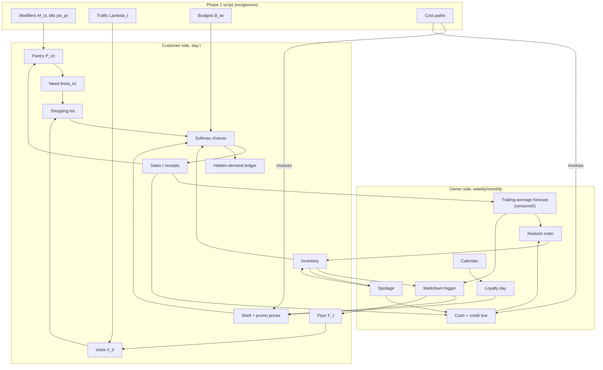

# Phase 3 Proposal — The Play, Performed: A Year of Market Days

Phase 1 built the world; Phase 2 wrote the script of its year. Phase 3 raises the curtain. This is the phase where the two sides of the market finally touch: where a customer with a half-empty pantry walks past a shelf whose price was set by a markup rule, on a day whose temperature was drawn last phase, and either buys, substitutes, or walks out — and where every one of those acts leaves (or pointedly fails to leave) a mark in the paperwork. Phase 3 is the only phase that *produces data*. Everything before it was cause; this is where the residue falls.

It is also the phase of feedback. Phases 1 and 2 were feed-forward by design — beliefs never met outcomes, the script never listened to the play. Phase 3 closes the loops: sales draw down inventory, inventory shapes what can be sold, observed sales reshape the owner's orders, orders meet the cost paths, and the cash ledger quietly decides whether the store can afford next week's stock. The loops are what make the dataset *alive*; unrolled over the 365 days, they remain a directed acyclic graph, because within any moment causality still flows one way.

The design goal, inherited from the README, is exact: a daily simulation with an hourly clock, customers acting on predetermined preferences with small deviations, an owner restocking by imperfect heuristic and running promotions, hidden demand recorded as latent truth, and payment method deciding what the analyst will ever see. This document specifies each mechanism, defends each distribution, and ends — as its siblings do — with the artifacts, the parameters, the plan, and the planted lessons.

**A note on notation.** All conventions carry over: McElreath-style distributions with standard deviations as scale parameters, $\sim$ stochastic, $=$ definitional, $\overset{\leftarrow}{=}$ causal. Indices: days $t \in \{1, \ldots, 365\}$, hours $h \in \{0, \ldots, 23\}$, weeks $w$, customers $i$, categories $c$, SKUs $s$. Phase 1 objects (budgets $B_i$, weights $w_{ic}$, sensitivities $\beta_i$, brand affinities $b_i$, schedules, the chosen location and initial inventory $q^*$) and Phase 2 paths (modifiers $\tilde{M}_{ct}$, tilts $\tilde{\psi}_{pt}$, traffic $\Lambda_t$, budgets $B_{iw}$, cost paths) are consumed, never re-derived. The five-touchpoint contract of Phase 2 §14 is honored exactly, with one refinement declared in Section 3.

---

## Part I — The Day: How a Transaction Comes to Exist

### 1 The clock

Each day runs an hourly clock through 24 hours. The store keeps its Phase 1 policy hours — **08:00 to 20:00**, twelve hours — and the neighborhood keeps its own rhythm, which is not the store's. A visiting customer's arrival hour is drawn from a fixed hour-of-day profile:

$$
h_{iv} \sim \text{Categorical}(p_{\text{hour}}),
$$

a two-humped shape with a morning shoulder (09:00–11:00), a lunchtime ripple, and a dominant after-work peak (17:00–19:00) — plus small but nonzero mass in the hours the store is closed (a late-shift worker at 21:00, an early riser at 07:00). The profile is **day-type dependent** (a validation-pass amendment): weekends shift the mass to a late-morning peak (10:00–12:00), because nobody is coming home from work on a Saturday — a store whose Tuesday and Saturday share an identical intraday shape is a store that was simulated. The Categorical needs the same one-line defense as Phase 1's shopping days: twenty-four unordered labels admit no other family, and the weights are read off common experience.

The out-of-hours mass is not sloppiness; it is the first entry in the hidden-demand ledger. A customer whose arrival hour falls outside 08:00–20:00 **is turned away**: no transaction, no receipt, and a ledger row recording the visit that never was. Their pantry stays empty another day, so — by the need mechanics of Section 3 — they return hungrier. The store's opening-hours policy, fixed by lifestyle in Phase 1, thus acquires a measurable price, and the prescriptive layer can later ask whether hour thirteen would pay for itself.

Within the day, transactions are processed **in arrival order**. This matters: stock is finite, and first-come-first-served is both the honest mechanism and the realistic one — the customer at 18:40 faces the shelf the 09:15 customer left behind.

### 2 The visit

Whether customer $i$ visits on day $t$ follows directly from Phase 1's schedule machinery, scaled by Phase 2's traffic path and this phase's one new instrument, the flyer:

$$
V_{it} \sim \text{Bernoulli}\!\left(\min\!\big(1,\ \Lambda_t\, (1 + \phi\, F_t)\, \pi_{it}\big)\right),
\qquad
\pi_{it} = \begin{cases} \pi_i & t \text{ is } i\text{'s primary day} \\ p_i & \text{otherwise,} \end{cases}
$$

where $F_t \in \{0,1\}$ flags a flyer week (Section 9) and $\phi = 0.05$ is its modest pull on traffic. On top of this, Phase 1's deviation probability finally does its work: with probability $0.05$ the visit decision **flips** — the creature of habit stays home, or the non-shopper wanders in. No distribution to defend here that Phase 1 has not already defended; the day's realized visit set is simply the sum of a few hundred Bernoulli lives.

A visit is one of two kinds, inherited from the schedule that produced it: a **primary trip** (the weekly shop, on the customer's primary day) or a **top-up** (quick, narrow, midweek). The distinction governs how much of the pantry the trip is allowed to worry about (Section 4).

**The passing trade.** Not everyone at the till lives in the model. Each day brings a stream of **guests** — commuters, visitors, someone's mother-in-law:

$$
G_t \sim \text{Poisson}\!\big(g_0 \cdot d_{\text{dow}} \cdot \Lambda_t\big), \qquad g_0 = 7,
$$

with day-of-week factors peaking Friday–Saturday and the same traffic modulation as everyone else (rain deters passers-by too; the Poisson is the maxent count of independent rare arrivals). A guest has no pantry, no schedule, and no profile — just a visit budget $\sim \text{LogNormal}(\log 14,\ 0.5)$, a price sensitivity and brand lean drawn fresh, and a small basket (one to three categories, chosen by popularity, one or two units each) run through the *same* softmax over the *same* shelf. Their purchases are recorded like anyone's; their identity is not recoverable — **even the answer key holds nothing but the visit**. This is a validation-pass amendment with a forensic purpose: a card panel in which every identity recurs weekly for a year is the signature of a closed simulation, whereas real till data carries a long tail of tokens seen once and never again. Guests supply that tail (roughly four times as many one-off card tokens as there are regulars), at about a tenth of revenue — passing trade in both senses.

### 3 The pantry

Phase 1 promised that need intensity would be "driven by the basket weights and time since the last purchase." Phase 3 makes that promise mechanical, with the simplest object that behaves correctly: a **pantry**.

Each customer carries a latent stock $P_{ict} \geq 0$ — how much of category $c$ they have at home, in units — which drains daily and refills only by purchase:

$$
\begin{align}
    P_{ic,t+1} &\overset{\leftarrow}{=} \max\!\big(0,\ P_{ict} - r_{ict}\big) + \text{(units bought on day } t) \\[4pt]
    r_{ict} &= r_{ic} \cdot \tilde{M}_{ct}, \qquad
    r_{ic} = \frac{w_{ic}\, B_i}{\bar{p}_c \cdot 7}
\end{align}
$$

The base drain rate $r_{ic}$ converts Phase 1's Dirichlet budget share into units per day using the category's median shelf price $\bar{p}_c$ — the customer who devotes 20% of an €85 budget to a €2-median category consumes about 1.2 units a day. Consumption is deterministic; the randomness of a household's life enters through visits, choices, and deviations, which is where it is observable anyway.

**The declared refinement.** Phase 2's contract stated the modifier would enter as an additive term on need intensity, $\theta_{ict} = \theta_{ic} + \log \tilde{M}_{ct}$. The pantry implements the same causal content one level deeper: a hot week does not make a customer *want* ice cream in the abstract — it makes the household *eat* it faster, so the tub runs out sooner, so the need arrives earlier and larger. Scaling the drain rate by $\tilde{M}_{ct}$ produces exactly the demand modulation the contract intended, plus two behaviors the utility-intercept form could not give for free: seasonal demand arrives with realistic *timing* (need follows depletion, not the thermometer directly), and the rain-rebound of Phase 2 §5 emerges with the correct magnitude (a missed visit leaves the drain running). The contract's other four touchpoints are consumed literally as written.

Need intensity is then the pantry's *shortfall* against the household's comfort level:

$$
\theta_{ict} = \alpha \cdot \frac{\max\!\big(0,\ P^{\text{tgt}}_{ic} - P_{ict}\big)}{P^{\text{tgt}}_{ic}},
\qquad
P^{\text{tgt}}_{ic} = \tau \cdot r_{ic},
$$

with $\tau = 10$ days of cover as the stock-up target and $\alpha$ the need weight calibrated against the outside option (Section 4). An empty pantry ($\theta = \alpha$) presses hard; a full one ($\theta = 0$) leaves the whole category to the outside option. Initial pantries are seeded at uniform random fill $P_{ic,0} \sim \text{Uniform}(0,\ P^{\text{tgt}}_{ic})$ so the opening week is not a synchronized stampede — the one place a Uniform is honest, since a household's phase in its own restocking cycle is precisely the thing we know nothing about.

### 4 The basket

A visiting customer builds a shopping list, then walks it, category by category, until the money runs out.

**The list.** A primary trip lists every category whose cover has fallen below the replenishment threshold ($P_{ict} < \rho_{\text{list}} \cdot P^{\text{tgt}}_{ic}$, with $\rho_{\text{list}} = 0.7$); a top-up lists only acute categories (cover below 2 days). The list is walked in **descending order of need** $\theta_{ict}$ — the urgent first, which is both how people shop and what makes the budget constraint bind believably: when money runs short, it is the marginal wants that fall off the list, not the milk.

**The choice.** At each listed category the customer faces the shelf as Phase 1 specified, now with every time-varying term in place:

$$
\begin{align}
    \text{choice} &\sim \text{Categorical}\!\left(\text{softmax}\big(U_{is_1 t}, \ldots, U_{is_K t},\ u_0\big)\right) \\[4pt]
    U_{ist} &= \theta_{ict} + \gamma \left(1 - \left| b_i - \text{BrandLevel}_s \right|\right)
              + \log \tilde{\psi}_{p(s), t}
              - \beta_i\, \text{EffectivePrice}_{st}
\end{align}
$$

over the SKUs of $c$ **currently in stock and listed**. $\text{EffectivePrice}$ is the shelf price after any live promotion — Phase 1's promise that "a discount is just a price change" is kept literally, so promotion response needs no new machinery and inherits each customer's own $\beta_i$. The tilt $\tilde{\psi}$ enters here, per Phase 2's contract, sliding January's frozen-aisle choices from ice cream toward meals within the same category need. The outside option $u_0$ means what it always meant: buy it elsewhere, or not this week — the neighborhood has other stores, and this one is entitled to only part of every household's spend. One bookkeeping consequence is mandatory for the model's stability: **when the outside option wins a listed category, the pantry refills anyway** — the household bought its pasta at the supermarket across town — with the event ledgered as `outside`, quantity and all. Without this, need lost to competitors would accumulate without bound, and by spring every basket would list every category; with it, the pantry stays stationary and the store's capture share is exactly what the softmax says it is. The pair divides its labor: $\alpha$ is a *shape* parameter (how steeply need translates into buying — fixed at $4$, so a full-shortfall need outweighs typical price differences but not extreme ones), and $u_0$ is the *level*, bisected numerically against one observable target: the store captures roughly **65% of its regulars' category spend**, a defensible figure for a convenient neighborhood store facing supermarket competition. The calibration is then verified end-to-end, not assumed: the validation suite computes realized annual capture — total receipts over the customers' total budget paths — and requires it near the target (the reference implementation lands at $0.61$; the small shortfall against the calibration point is stockouts and budget-binding doing their work, and is itself realistic).

**The quantity.** Having chosen a SKU, the customer buys toward the shortfall — $\lceil (P^{\text{tgt}}_{ic} - P_{ict}) \cdot \kappa \rceil$ units with a carry fraction $\kappa \sim \text{Uniform}(0.7,\ 1.0)$ (people rarely haul the entire gap home in one trip), capped by a per-trip carrying limit drawn uniformly from $\{8, \ldots, 15\}$ (a bag day versus a car day) and by what remains of the weekly budget $B_{iw}$ (Phase 2's path, wobbles, spells and all). The stochastic fraction and cap are validation-pass amendments: a single hard cap of 12 printed a visible spike at exactly twelve units in the quantity histogram, and no real till shows a cliff at a number the simulation chose. Quantity remains a *consequence* of the pantry, not a new random object — the right correlations for free: the customer who missed last week buys visibly more this week.

**The impulse.** With probability $0.05$ per visit, one extra item — a random affordable SKU from a random unlisted category — lands in the basket. This is Phase 1's deviation probability acting on the basket rather than the visit, and it plants a thin, irreducible layer of unexplainable variance in the line items: the analyst's $R^2$ is not allowed to reach 1, because nobody's does.

**Budget discipline.** Each purchase debits the week's remaining budget; when a wanted quantity cannot be afforded it is trimmed to what can, and when nothing can, the walk stops and every remaining list entry is written to the hidden-demand ledger with cause `budget`. The constraint binds exactly where Phase 1 said it would — list-item by list-item — and the tight-spell households of Phase 2 will be seen (by whoever can see them) trimming from the bottom of their need ranking, sliding down the brand ladder as $\beta_i$-weighted prices loom larger against a shrunken $B_{iw}$.

### 5 Stockouts, substitution, and the hidden-demand ledger

When the softmax selects a SKU with insufficient stock, three things happen in order. The *original* choice is logged — SKU, intended quantity, timestamp — as latent truth with cause `stockout`. The customer then **re-evaluates the same softmax without the missing option** (buying what stock remains of it first, if any): probability mass flows to the nearest neighbors in brand-level space, and some leaks to the outside option, exactly the substitution structure Phase 1's logit was chosen to produce. If the re-choice lands on another stocked SKU, the sale proceeds; if on the outside option, the store has lost a sale it will never see in its data.

The ledger therefore accumulates four causes, each a different flavor of invisible demand:

| Cause | Mechanism | What the store's data shows instead |
| --- | --- | --- |
| `closed` | arrival hour outside 08:00–20:00 (Section 1) | nothing at all |
| `stockout` | chosen SKU unavailable (this section) | a substitute sale, or nothing |
| `budget` | weekly budget exhausted mid-list (Section 4) | a shorter receipt |
| `outside` | outside option beat every shelf price | nothing — indistinguishable from no need |

This ledger *is* the unconstrained-demand ground truth the README promises for the censored-demand analyses: sales data are demand data censored by four different mechanisms, and every censoring event is recorded with its cause. The cruelest consequence is saved for Section 8: the owner's own forecasts are trained on the censored series.

### 6 The till

Payment happens as Phase 1 wired it: the persistent type $T_i$ sets the per-visit card probability ($0.95$ card-preferring, $0.10$ cash-preferring), and **the receipt carries `customer_id` only when the card is used**. The identifier itself is a **hashed POS token** (a validation-pass amendment — sequential integers 0…258 in a customer column would confess the simulation on sight): regulars' tokens recur across the year, guests' tokens appear once or twice and vanish, and nothing in the format distinguishes the two — exactly what a card terminal actually yields. The expected identified share is $0.6 \times 0.95 + 0.4 \times 0.10 = 0.61$ of transactions — enough to do customer analytics, far from all of it, and (because $T_i$ was drawn independently of budget and tastes) missing *at random* in iteration 1: a mercy the analyst is not entitled to expect in real data, is welcome to test for, and — per Phase 1's design — will actually find.

Each transaction writes one receipt: timestamp to the hour, line items (SKU, quantity, unit price paid, promotion flag), payment method, and the conditional identity. Receipts are the dataset's center of gravity — everything else in the paperwork exists to explain them.

---

## Part II — The Owner's Year

### 7 What the owner sees

The owner's information set, fixed here so every behavior below is auditable: his own **sales** (the censored series — he sees what sold, not what was wanted), his **inventory** (he counts stock; stockouts he notices only as empty shelf, not as turned-away euros), his **invoices and bills** (realized wholesale costs, wages, utilities — the Phase 2 paths at the dates they bite), his **cash position**, and the **weather out the window**. He does not see pantries, need states, the ledger, the multipliers, or the event log. He is Phase 1's man throughout: rational about the wrong numbers, now with twelve months of increasingly misleading experience to be rational about.

### 8 The weekly restock

Every **Monday** the owner places an order; it arrives Wednesday morning (a two-day lead time — long enough that intra-week timing matters, short enough to stay out of the way). His quantities come from the simplest forecast a shopkeeper actually runs — a trailing average:

$$
\hat{D}^{\text{op}}_{cw} \overset{\leftarrow}{=} \frac{1}{4} \sum_{j=1}^{4} \text{Sales}_{c, w-j}
$$

seeded in the opening weeks by his Phase 1 beliefs $\hat{D}_{cl^*}$ (converted to weekly, $\times 7/30$), which the data gradually dilutes. He then orders **up to** a target that a real shopkeeper's arithmetic would produce — enough to last until the *next* order can arrive, plus his Phase 1 minimum-stock rule:

$$
\text{OrderQty}_{sw} = \max\!\left(0,\ \text{Target}_{sw} - \text{OnHand}_{sw} - \text{OnOrder}_{sw}\right),
\qquad
\text{Target}_{sw} = \Big(\underbrace{\tfrac{R + L}{7}}_{\text{until next delivery}} + \underbrace{\eta\,\tfrac{30}{7}}_{\text{Phase 1's minimum}}\Big)\, \hat{D}^{\text{op}}_{cw}\, \tilde{\sigma}_{sw}
$$

with $R = 7$ (weekly review), $L = 2$ (lead), and Phase 1's flat $\eta = 0.3$ *of a month's* believed demand, unchanged and unrepentant — about $2.6$ weeks of believed cover in total. The per-SKU allocation $\tilde{\sigma}_{sw}$ is the category's recent sales split with **one pseudo-unit of smoothing**, $\tilde{\sigma}_{sw} = (\text{Sales}_{s} + 1) / (\sum_{s' \in c} \text{Sales}_{s'} + K_c)$ — a shopkeeper never quite gives up on a listed product, and this one-unit floor is what keeps the fixed assortment of Decision 3 (Section 19) mechanically alive. Orders are capped by shelf capacity and by **cash**: if the till plus remaining credit headroom cannot pay the invoice, the whole order is scaled down proportionally. A struggling store visibly thins its own shelves — distress becomes legible in the inventory data months before it reaches the P&L.

Note the quiet arithmetic joke buried in the target, worth an exhibit of its own in the prescriptive layer: $\eta \cdot 30 = 9$ days — the owner's minimum-stock rule and his own review-plus-lead cycle ($R + L = 9$ days) are almost exactly the same size. What he believes is a *safety buffer* is, unbeknownst to him, spent covering his own logistics; his true buffer against demand variability is approximately nothing, and it is the shelf, not his prudence, that decides which SKUs survive a surprising week.

This rule is a nest of deliberate, realistic pathologies, each one a planted lesson:

* **It is backward-looking.** A four-week average *lags* every seasonal upswing — most violently for the tilted product types, whose demand moves fastest: June's ice-cream order is sized to May's sales. Category totals mostly survive (the cover is 2.6 weeks); it is the *allocation* $\tilde{\sigma}_{sw}$, frozen a month behind, that starves the SKUs whose season is arriving and fattens the ones whose season just left. Phase 1's flaw #4 — no anticipation — is now a measurable time series of SKU-level misses.
* **It is censored-data-blind.** He averages *sales*, and sales are demand truncated by his own stockouts. A SKU that stocks out repeatedly reports weak sales, earns a smaller allocation, and stocks out again: the **censoring spiral**, one of the most instructive traps in retail analytics, arising here from two honest mechanisms rather than an injected bug. (The one-unit smoothing floor keeps the spiral damped rather than fatal — a starved SKU keeps receiving its trickle — so the store limps, it does not die.)
* **It never touches prices.** Repricing happens only as pass-through: at each delivery, the shelf price is checked against a smoothed cost trend and moved only past a 3% band (Phase 2 §9's menu-cost hysteresis) — Phase 2's instrumental-variable machinery, operating on schedule, at a realistic cadence rather than every delivery.

### 9 Promotions and the flyer

Twice-armed marketing, one arm dirty and one arm clean — by design, because the contrast *is* the lesson.

**The markdown (endogenous).** When a category's weeks-of-cover exceeds a threshold ($\text{OnHand} / \hat{D}^{\text{op}} > 4$ weeks — audit-calibrated: at the 2.6-week order-up-to target a threshold of 6 never fires, and a promotion instrument that never fires teaches nothing), the owner marks down its slowest third of SKUs for a two-week promotion, with depth drawn from the shallow menu real stores use:

$$
\text{depth} \sim \text{Categorical}\big(10\%: 0.5,\ \ 20\%: 0.35,\ \ 30\%: 0.15\big),
$$

announced with a **flyer** (fixed cost €40 per promo week; the $\phi = 0.05$ traffic pull of Section 2). The trigger is the point: markdowns are aimed at *what is not selling*. Any naive before/after comparison of promoted SKUs is therefore poisoned by selection — the promoted items were chosen for their weakness — and the naive MMM will understate promotion lift for exactly the reason real-world MMMs do. The promotion log records trigger, timing, depth, SKUs, and cost, so the careful analyst can model the selection; the ground truth (every customer's $\beta_i$, the softmax) says what the lift truly was.

**The loyalty day (exogenous).** On the **last Sunday of every month**, 5% off storewide, announced in advance, triggered by nothing but the calendar. Because it is announced, the neighborhood *responds to the announcement*: visit probabilities rise by ~15% that day — without this channel a 5% discount barely dents pantry-driven quantities (the reference implementation measured a ×1.02 revenue blip before adding it), and a marketing instrument nobody notices identifies nothing. Twelve clean pulses of price variation, uncorrelated with demand or stock by construction — the identification-friendly counterpart the analyst can use to anchor elasticity estimates before untangling the markdowns. The pairing deliberately mirrors Phase 2's instrument lesson: one clean source of variation, one confounded one, and the answer key knows which is which.

### 10 Spoilage

A grocery store that never throws food away is a fantasy, and the fantasy would distort everything downstream — inventory costs, promotion triggers, the value of demand forecasting itself. So perishables perish, and they perish **overnight, every night**, at a rate the day itself helps decide:

$$
\text{Spoiled}_{st} \sim \text{Binomial}\!\big(\text{OnHand}_{st},\ \min(0.35,\ \lambda^{d}_{c(s)}\, f_{c(s),t})\big),
\qquad
\lambda^{d}_{c} = 1 - (1 - \lambda_{c})^{1/7},
$$

with the *weekly* base rates $\lambda_c$ — the interpretable parameters — set by category physiology: Bakery 0.18, Seafood 0.18, Fresh Produce 0.14, Meat 0.09, Dairy 0.06, Frozen 0.01, everything else 0. The **spoilage factor** $f_{ct}$ (a calibration-pass amendment: the original flat, harsher rates put shrinkage at an eyebrow-raising 8% of revenue, and shrinkage that never varies is its own tell) is part of the Phase 2 script, log-additive and normalized to annual mean one:

$$
\log f_{ct} = \kappa^{T}_c \cdot \frac{T_t - \bar{T}}{10} \;+\; \kappa^{E}_c \cdot \bar{g}_t \;+\; \text{Normal}(0,\ 0.25),
$$

three causes with three stories. **Heat** ($\kappa^T$, strongest for the ambient perishables — bread and produce sitting on open shelves — weakest for frozen): a hot day is an edibility tax, so summer write-offs run about twice winter's. **Cold-chain strain** ($\kappa^E$, loading on the energy crisis's trajectory $\bar{g}_t$, strongest for frozen and dairy): the October event reaches the store through a third door — invoices, the utilities meter, and now the bin. And **batch luck** (the lognormal wobble): one delivery travels badly, one doesn't — real shrinkage is lumpy. Both responses are new planted lessons: write-offs that track temperature are a diagnostic regression waiting to be run, and a refrigerated write-off spike *dates* the crisis in a table that never mentions it. The Binomial remains the story it always was — each unit independently crosses its edibility line that night, at that night's rate — the maximum-entropy count of casualties given the rate.

Why daily rather than a weekly cull? Because the inventory snapshots are *visible* (Section 16), and a once-a-week spoilage event would stamp a sawtooth into every perishable's daily series — a periodic artifact no real shelf produces, and exactly the kind of made-not-found signature this project is sworn to avoid. Nightly thinning costs the same one line of code and leaves the decay smooth. (Per-lot expiry dates with first-expired-first-out rotation would be finer-grained still; that is settled as Decision 2 of Section 19 — thinning now, lots only if a later iteration wants shelf-life optimization.)

Write-offs are logged and costed. And one more Phase 1 flaw joins the catalogue: **the owner's planning is spoilage-blind** — his Phase 1 MILP ignored it, and his weekly cover targets ignore it still, so his perishable orders are systematically too fat, and the write-off line in the cost sheet is the visible receipt for an invisible error. The oracle of Section 14 does not make this mistake, and the analyst can price it.

### 11 The ledger and the credit line

Money moves on its own calendar. Daily: sales revenue in. On delivery: invoices out. Monthly close: rent, wages ($E^{h*}$ *hired* staff at the Phase 2 wage path, 12 h/day — the owner works unpaid, per Phase 1 §7, so a low-traffic store's wage line is legitimately zero), utilities (hours × the crisis-inflected rate path), storage (units on hand × rate), flyer costs, write-offs recognized.

When the close would take cash below zero, the owner draws on a **credit line** at 8% annual interest, repaying automatically when cash recovers. Refinancing — which the README names as the owner's response to business risk — is thus mechanical, auditable, and priced: the interest line in the cost sheet is the *direct monetary cost of every planning error upstream*, from optimistic Phase 1 beliefs to spoilage-blind orders to the October crisis. When the analyst later computes what better forecasting would have been worth, part of the answer is sitting in the interest column.

---

## Part III — The Year, Performed

### 12 The simulation loop, and the discipline of randomness

One day of the world, in execution order:

1. **Morning:** overnight spoilage draw applied; deliveries arrive (Wednesday); shelf prices reset to pass-through on delivered SKUs; loyalty-day and promo prices switch on.
2. **Trading hours:** realized visitors drawn (Section 2), sorted by arrival hour; each processed in order — list, choices, stockout re-evaluations, quantities, budget discipline, payment, receipt. Out-of-hours arrivals ledgered.
3. **Evening:** pantries drain by $r_{ict}$; end-of-day inventory snapshot written.
4. **Weekly (Monday):** owner forecast update, restock order, promo triggers evaluated.
5. **Monthly (last day):** ledger close, credit line movement.

**The discipline.** Phase 2 §13 imposed one hard requirement, and it is honored as architecture, not convention: every stochastic draw is made from a stream **keyed by stable identity** — a child `Generator` spawned per customer (visits, choices, payment, impulses), per SKU (spoilage), and per subsystem (owner's promo depths), with day and decision type indexing within. No draw is ever taken from a shared sequential stream. The payoff is the counterfactual machinery: replay the year with the energy crisis deleted, and customer 412's Tuesday coin flips land identically in both worlds — the runs differ *only* through the causal channels of the edit, and the four standing counterfactuals of Phase 2 §13 (plus the oracle below) are exact by construction. A unit test asserts this: delete one event, diff the draw logs of untouched customers, require zero.

At the scale in question — ~350 customers averaging 1.5 visits a week (0.86 expected primary trips plus six chances at a mean-0.11 top-up), so roughly 75 visits a day and ~27,000 receipts a year — the whole year runs in seconds in NumPy, and a 200-seed validation sweep stays cheap.

### 13 The causal graph

The within-day structure, unrolled implicitly over $t$ (every right-pointing arrow into day $t+1$ is a feedback loop made acyclic by time):



Everything the analyst receives descends from `SALE`, `STK`, `PRICE`, `PROMO`, and `CASH`; everything they are graded against lives in `HD`, `PAN`, `NEED`, and the Phase 1–2 parameter tables.

### 14 The three numbers

Phase 1 §10 promised that three profit figures would one day sit side by side. Phase 3 is where all three become computable:

1. **Believed profit** — the Phase 1 MILP objective: what the owner thought the first month would bring, extended by his own rules over the year.
2. **Realized profit** — the ledger's bottom line after 365 days of this document: the number a real accountant would certify.
3. **Oracle profit** — the `oracle-owner` counterfactual of Phase 2 §13, now fully specified: same world, same script, same customers, same rules *shapes* — but the trailing-average forecast replaced by the true seasonal demand $D_{cl^*} \tilde{M}_{ct}$, spoilage priced into cover targets (the safety buffer shrinks in proportion to each category's spoilage rate, balancing waste against stockouts instead of applying one flat cover), and stockout censoring undone. Everything else — markup rule, opening hours, flat $\eta$ — stays, so the oracle isolates the value of *information*, not of a different personality.

Realized minus believed measures the cost of optimism. Oracle minus realized measures **the value of analytics** — the single number the entire project exists to make credible, and it will be computed, not asserted.

### 15 The planted lessons

Phase 3's own contributions to the answer key, joining Phase 1's five flaws and Phase 2's seven textures:

| # | Planted lesson | Mechanism | Discoverable by |
| --- | --- | --- | --- |
| 1 | Sales ≠ demand | four-cause censoring, each cause ledgered | censored-demand modeling, unconstrained forecasting |
| 2 | The censoring spiral | owner forecasts on his own stockout-truncated sales | diagnostic; inventory optimization on *de-censored* demand |
| 3 | Promotion selection bias | markdowns triggered by overstock target weak SKUs | MMM — naive lift vs. selection-aware lift, graded against true $\beta_i$ |
| 4 | One clean pulse | calendar-triggered loyalty day, exogenous by construction | elasticity anchoring; the clean/confounded contrast with lesson 3 |
| 5 | Emergent rhythms | weekend surge and 17–19 h peak arise from Phase 1 schedules, not from any day-of-week parameter | descriptive — and a modeling trap: fitting day-of-week effects to what is really schedule composition |
| 6 | Distress in the shelves | cash-capped orders thin the assortment before the P&L shows trouble | descriptive/diagnostic — leading indicators |
| 7 | Spoilage-blind planning | perishable cover targets ignore $\lambda_c$ | prescriptive — perishable-aware ordering, valued in write-off euros |
| 8 | Missingness the analyst must test | card-only identity, MAR by design in iteration 1 | the test itself is the lesson: verify, don't assume |
| 9 | Spoilage has causes | write-offs track heat (ambient categories ~2× in summer) and spike for refrigerated goods during the energy crisis | diagnostic — regressing the write-off table on weather and the cost-shock timeline |
| 10 | Clean before you count | the recording layer (§20): duplicated uploads, double-posted and missing invoices, unlogged tosses, snapshot typos, label drift | data cleaning, graded against `hidden/imperfections.csv`; the receipts-vs-ledger reconciliation only closes after the dedup |

### 16 What Phase 3 hands over

This is the dataset — the deliverable of the entire simulation. Visibility rules follow the README's recorded-data list exactly.

| Artifact | Key columns | Visibility |
| --- | --- | --- |
| `receipts` | receipt_id, date, hour, payment_method, customer_id (hashed token, card only); line items: sku, qty, unit_price_paid, promo_flag; ref_receipt_id on refund transactions (§21) | **visible** — the center of gravity |
| `inventory_eod` | date × sku: on_hand | **visible** |
| `procurement` | order date, delivery date, posted date (§20), sku, qty, unit_cost (invoice) | **visible** |
| `price_history` | sku, date range, shelf_price | **visible** |
| `promotions` | promo_id, type (markdown/loyalty), skus, depth, start/end, flyer_cost | **visible** |
| `cost_sheet` | month: rent, wages, utilities, storage, procurement, flyers, write_offs, credit_interest | **visible** |
| `write_offs` | date × sku: units, reason ∈ {spoilage, stock_count} (§20) | **visible** (logged tosses plus the monthly count's shrinkage corrections) |
| `calendar`, `weather` | from Phase 2 | **visible** |
| `hidden_demand` | timestamp, customer, sku/category, intended qty, cause ∈ {closed, stockout, budget, outside} | **hidden** (answer key) |
| `latent_choices` | every pre-stockout original choice | **hidden** |
| `pantry_traces`, `need_states` | daily latent states | **hidden** |
| `guests` | date, token (or cash), basket value per guest visit | **hidden** — and deliberately thin: no profile exists to hide |
| `spoil_factors` | date × perishable category: the realized spoilage factor $f_{ct}$ | **hidden** (the graded truth for lesson 9) |
| `owner_forecasts` | week × category: $\hat{D}^{\text{op}}$ | **hidden** (his private spreadsheet) |
| `profit_triptych` | believed / realized / oracle, with full decomposition | **hidden** — the final answer key |
| `imperfections` | kind, table, key, date, delta, note — one row per injected document defect (§20) | **hidden** — the data-cleaning answer key |

### 17 Default parameters

```python
PHASE3_PARAMS = {
    "seed": 20260712,            # master seed; per-entity child streams (Section 12)
    # --- The clock (Section 1) ---
    "opening_hour": 8, "closing_hour": 20,
    "hour_profile": "two-peak profile over 24h; ~4% total mass outside opening hours",
    # --- Visits (Section 2) ---
    "flyer_traffic_lift": 0.05,
    "deviation_prob": 0.05,      # Phase 1's parameter, acting on visits and impulses
    # --- Pantry (Section 3) ---
    "pantry_target_days_tau": 10,
    "list_threshold_rho": 0.7,   # primary trip lists categories below 70% of target
    "topup_threshold_days": 2,
    "need_weight_alpha": "calibrated jointly with u0",
    "outside_option_u0": "calibrated: store captures ~65% of regulars' spend",
    # --- Basket (Section 4) ---
    "carry_frac": (0.7, 1.0),        # fraction of the shortfall actually hauled home
    "carry_cap": (8, 16),            # per-trip carrying limit, uniform 8..15 units
    "impulse_prob": 0.05,
    # --- The passing trade (Section 2) ---
    "guests": {"base_per_day": 7.0,
               "dow_factor": [0.8, 0.8, 0.9, 1.0, 1.2, 1.5, 1.3],  # Mon..Sun
               "visit_budget_lognormal": (2.64, 0.5),              # ln(14), sd
               "extra_cats_poisson": 1.0, "qty2_prob": 0.35, "need_theta": 0.45},
    # --- Owner: restock (Section 8) ---
    "restock_weekday": "Monday", "lead_time_days": 2,
    "forecast_ma_weeks": 4,
    "safety_stock_eta": 0.30,    # of a MONTH's believed demand (Phase 1's policy): ~1.29 weeks
    "allocation_smoothing_units": 1,  # Laplace floor: every listed SKU keeps a trickle (Decision 3)
    # --- Promotions (Section 9) ---
    "promo_trigger_weeks_cover": 4.0,   # audit-calibrated (6.0 never fires at 2.6-wk cover)
    "promo_sku_fraction": "slowest third of the category",
    "promo_depth_menu": {0.10: 0.50, 0.20: 0.35, 0.30: 0.15},
    "promo_duration_days": 14,
    "flyer_cost_per_week": 40.0,
    "loyalty_day": "last Sunday of each month", "loyalty_depth": 0.05,
    "loyalty_traffic_lift": 0.15,       # the advertised day pulls extra visits
    # --- Spoilage (Section 10): weekly per-unit rates, applied nightly as 1-(1-l)^(1/7) ---
    "spoilage_weekly": {
        "Bakery and Bread": 0.18, "Seafood": 0.18, "Fresh Produce": 0.14,
        "Meat and Poultry": 0.09, "Dairy and Eggs": 0.06, "Frozen Foods": 0.01,
        # all remaining categories: 0.0
    },
    # daily factor loadings: (heat per +10C vs annual mean, cold-chain strain)
    "spoil_response": {"Bakery and Bread": (0.5, 0.0), "Fresh Produce": (0.6, 0.0),
                       "Seafood": (0.3, 0.5), "Meat and Poultry": (0.3, 0.5),
                       "Dairy and Eggs": (0.25, 0.6), "Frozen Foods": (0.1, 0.8)},
    "spoil_wobble_sd": 0.25, "spoil_daily_cap": 0.35,
    # --- Finance (Section 11) ---
    "credit_apr": 0.08,
    "monthly_close": "last calendar day",
}
```

### 18 Implementation plan

The performance engine, consuming Phase 1's artifacts and Phase 2's script:

1. `PHASE3_PARAMS` — the dictionary above
2. `init_state(phase1, phase2)` — inventory $q^*$, prices, pantries, cash, forecast seeds
3. `run_day(state, script_t, streams)` — Sections 1–6: visits, baskets, till, ledger rows
4. `owner_weekly(state, streams)` / `owner_monthly(state)` — Sections 8–11
5. `run_year(...)` — the loop of Section 12, emitting artifacts incrementally
6. `compute_triptych(...)` — Section 14, including the oracle replay
7. `export_artifacts(...)` — Section 16
8. `counterfactual(edit, ...)` — the Phase 2 §13 replays, sharing `run_year` verbatim

**Validation checklist** (200-seed sweep, same discipline as Phase 2's):

* **conservation, exactly**: for every SKU, initial + purchased − sold − spoiled = ending inventory; every euro of cash movement matches a ledger line; zero tolerance on either
* perishable inventory decays smoothly — no weekly sawtooth or other periodic artifact in the visible snapshots beyond what deliveries and sales genuinely cause
* spoilage lands at 3–7% of revenue (reference implementation: 4.7%) — a visible flaw, not a caricature — and ambient categories' write-offs peak in summer (JJA/DJF > 1.3; reference: 2.3)
* the year runs in under a minute per seed; no negative inventory, no negative cash outside the credit line
* card-carrying share of receipts lands near 0.61; weekend (Fri–Sun) revenue share in the 65–70% band (Phase 1's day weights put 72% of *primary-trip* spend there, and midweek top-ups dilute it); the 17–19 h peak visible in every seed
* stockout rate in a plausible retail band (2–8% of SKU-days; the reference implementation lands at 7%), *seasonally patterned* — shelf pressure plus the month-stale allocation concentrate the misses in each product's high season (ice-cream stockout losses peak in July–August, at 5–8× their winter level)
* realized annual capture (receipts ÷ total customer budgets) lands near the 0.65 calibration target
* markdown promos fire a handful of times per year (not zero, not weekly); measured naive markdown lift < true lift (the selection bias points the right way), loyalty-day lift ≈ true
* ice-cream receipts show the 2–3× summer/winter swing end-to-end; the placebo category shows none
* believed > realized (optimism costs), oracle > realized (information pays), across every seed
* the CRN unit test of Section 12 passes: counterfactual edits leave untouched entities' draws bit-identical
* **forensic-realism checks** (added by the validation pass, all measured in the reference implementation): the card panel shows a long tail (>800 distinct tokens, most appearing ≤2 times); shelf-price endings are *mixed* — 75–95% end in 9 with .x5 and .x0 both present (a 100% charm share is itself a tell; see Phase 1 §8); same-day within-category repricings differ SKU by SKU (sd > 0, not the fingerprint of a uniform category shift); daily visits are overdispersed (var/mean ≈ 1); no single high quantity claims a visible spike; weekday receipts peak 17–19 h while weekend receipts peak late morning; a handful of stocked SKUs barely sell all year; **repricing cadence lands at a median of 3–15 changes per SKU per year** (Phase 2 §9's hysteresis, not a change on every delivery); **daily revenue shows genuine day-to-day persistence** (lag-1 autocorrelation of the weekday-adjusted series > 0.05, the fingerprint of the AR(1) traffic shock of Phase 2 §5, not i.i.d. noise)

### 19 The open questions, decided

Settled under the same two criteria that decided Phase 2's (§17 there): **consistency** — no mechanism may contradict another phase, an interface, or the project's own promises — and **realism** — the data must look found, not made. One decision amends the model; four confirm the drafts, each with the argument that actually carried it.

1. **Units vs. pack sizes — decided: demand is denominated in packs** (1 SKU unit = 1 purchase unit). Consistency decides this almost alone: Phase 1's demand potentials, shelf capacities, MILP quantities, and storage costs are all already unit-denominated, so per-gram accounting would ripple a redefinition through two finished proposals to purchase nothing — the catalog's `retail_base_price_EUR` already encodes pack size, so price-per-value heterogeneity within a category survives intact, which is all the choice model ever consumes. And realism concurs: a till scans packs; receipts count them; the analyst's data would look no different.

2. **Spoilage granularity — decided: Binomial thinning, applied nightly** (Section 10, amended). The draft's *weekly* thinning failed a realism audit against the phase's own artifact list: daily inventory snapshots are visible, and a Monday cull would print a weekly sawtooth into every perishable's series — a periodic artifact with no physical cause, begging to be "discovered" by the first Fourier transform an analyst runs. Nightly thinning at $\lambda^d_c = 1-(1-\lambda_c)^{1/7}$ compounds exactly to the same weekly rates, costs the same line of code, and decays smoothly. Per-lot expiry with FEFO rotation stays deferred: it would matter only to a shelf-life-optimization lesson no analysis layer currently claims, and unbiased thinning keeps write-off totals honest in the meantime.

3. **Assortment churn — decided: the assortment is fixed for the year.** Realism could argue either way — real owners do prune dead SKUs, but slowly, and rarely within a first year of sunk listing decisions and standing supplier relationships; a no-churn first year is entirely believable. Consistency breaks the tie decisively: delisting would let the owner quietly destroy the evidence of planted lesson #2 — a censoring-spiral SKU that gets delisted mid-spiral truncates the very time series the analyst needs to diagnose the spiral — and would fragment every SKU-level panel the analysis notebooks depend on. Churn dynamics (delisting rules, new-product trials) are a worthy lesson with its own selection-bias payload, and they deserve their own iteration rather than a cameo here.

4. **A loyalty *program* — decided: deferred to iteration 3; the loyalty day stays storewide and anonymous.** The membership-card selection trap (identified customers over-representing discount days) is genuinely tempting, but it collides head-on with planted lesson #8, which *depends* on iteration 1's missingness being MAR: the lesson is that the analyst must test the missingness mechanism rather than assume it, and find that — this once — the test passes. Springing both the clean case and the trapped case in the same dataset teaches neither well. Sequence them: MAR now, verified by the analyst's own test; the membership trap in iteration 3, where the same test fails and the analyst learns why the first result was never a law of nature. Realism loses nothing — plenty of small stores run advertised discount days with no membership scheme.

5. **Queuing — decided: no queue model**, and now with the arithmetic that makes the omission safe rather than blind. The busiest plausible day — a pre-holiday, flyered Saturday — brings ≈ 175 visits, whose peak hour carries ≈ 24 customers. At ~2.5 minutes per checkout, one clerk handles 24/hour, two handle 48, three handle 72. The 1-clerk case sounds tight until Phase 1's structure is remembered: `OperationalNeeds` rises with location quality, so a 1-clerk store exists only at a low-traffic location whose whole customer pool is ~40% the size — its peak hour is ~10, comfortably inside capacity. Staffing scales with traffic *by construction*, congestion never binds anywhere the MILP can actually put the store, and a queue model would simulate a phenomenon the world has been designed not to produce.

### 20 The recording layer — how the books get dirty (2026-07-14 amendment)

The independent audit of the first generated year returned an A− with one structural objection: **the records are perfect**. Revenue ties to the cent, the perpetual-inventory identity closes exactly on every SKU-day, every paid price matches its posted price, and no document is ever missing, doubled, or mistyped. Real books are never like this, and a forensic reader would (correctly) take the perfection itself as evidence of fabrication. This section adds the missing layer: the store's *paperwork*, as distinct from the store's *physics*.

**The design principle: physics stays clean; only the documents err.** The simulation of Sections 1–14 is reality, and it is not touched — every imperfection is injected at export time, into the visible artifacts only, from its own keyed stream (`K_DIRT`, one child per defect family), so the CRN discipline of Section 12 survives untouched and the oracle replay never sees a dirty page. This is not merely convenient; it is the honest model of where errors live. A clerk who double-posts an invoice does not conjure stock into existence — the shelf holds what it holds, and only the *book* is wrong. Every injected defect is simultaneously written to `hidden/imperfections.csv`, one row per defect with enough detail to undo it: the answer key for the data-cleaning grade.

**The mechanisms and their rates** (each rate small enough to be found, not so large as to be a caricature):

| # | Defect | Mechanism | Rate (reference year) | Visible fingerprint |
| --- | --- | --- | --- | --- |
| D1 | Duplicate receipt upload | POS retry re-posts an entire receipt, same `receipt_id`, all lines twice; the copies sit *adjacent* to the original in the (chronological) journal | ~0.2% of receipts (~34) | receipts where *every* line's multiplicity is even |
| D2 | Placeholder timestamp | POS clock glitch stamps `hour = 0` on all of a receipt's lines | ~0.4% of receipts | sales at an hour the store is closed |
| D3 | Payment-label drift | hand-keyed or terminal-batch variants: `Card`, `CASH`, `cash ` | ~1.2% of receipts | `GROUP BY payment` returns five labels for two methods |
| D4 | Duplicate invoice posting | a supplier invoice entered twice, days apart — constrained to land *before* the month-end count that will correct it, so the paper trail never runs backwards in time | ~0.4% of procurement rows (~22) | identical (sku, qty, cost, dates) pairs with different `posted_date` |
| D5 | Missing invoice line | a delivery received but never entered | 6 rows | stock jumps on a delivery day with no matching invoice |
| D6 | Late posting | one lag per *delivery* (the clerk keys a delivery's paperwork in one batch: 0 d w.p. 0.70, 1–2 d w.p. 0.25, 3–9 d w.p. 0.05), plus ~4% straggler lines entered 1–2 days later | 1–4 distinct posting dates per delivery | month-end procurement cutoff errors |
| D7 | Unrecorded spoilage | staff toss stock without logging it | ~2.5% of write-off rows dropped (~170) | the dominant source of count shrinkage |
| D8 | Snapshot typo | a digit slip in one night's `on_hand`, self-corrected next day | 24 rows | the perpetual identity breaks on exactly two consecutive diffs |
| D9 | Sensor outage | the weather feed goes dark for a short spell | 3 spells, 1–3 days | `NULL` temperature and rain on trading days |
| D10 | Category typo | `Snacks and Confectionary` in the promotions log | 2 rows | a join that silently drops promotions |
| D11 | Voided mis-ring | the cashier scans the wrong item and voids it on the spot: a +q line and a matching −q line of a real product at that day's real shelf price, netting to zero money and zero inventory | ~0.6% of receipts (~100 pairs) | negative quantities on the till tape, each with its partner line |

**The drift algebra.** Let $D_{st}$ be SKU $s$'s cumulative *book-minus-true* discrepancy: duplicate invoices raise it, missing invoices and duplicate receipts lower it, unrecorded spoilage raises it. The visible `inventory_eod` becomes **book stock** $B_{st} = S_{st} + D_{st} - \sum_{c \le t} A_{sc}$, where $S$ is the simulation's true stock. On the last day of each month the owner counts the shelf and posts the adjustment $A_{sc} = (B - S)_{sc^-}$ to `write_offs` with the new `reason = "stock_count"` label (existing rows carry `reason = "spoilage"`); the book snaps to physical truth and begins drifting anew. Two consequences are deliberate: the day-to-day identity *still closes exactly against the recorded documents* (that is how ERPs work — book stock is derived), so the realism lives in the monthly shrinkage lines, the occasional **negative book stock**, and the document defects an analyst can cross-examine; and because unrecorded spoilage dominates the drift, the monthly adjustments are mostly losses — the familiar shape of retail shrinkage — with occasional gains where a missing invoice or duplicated receipt tipped the balance.

**Planted lesson #10 — clean before you count.** Raw receipts now overstate revenue by the duplicated uploads; the ledger (`cost_sheet`, the owner's own accounting, which stays clean) disagrees with the receipt file until the analyst deduplicates; the spoilage table understates true waste by exactly the unrecorded tosses. The dedup rule is decidable: a receipt is a POS retry **iff every distinct line's multiplicity is even** — verified against the reference year, where zero legitimate receipts have that property (the generator asserts this before selecting its victims, and skips any that do). Same for D4: the truth contains no duplicate (sku, delivery-date) invoice pairs, so exact-key dedup is sound.

**Validation additions** (the recoverability contract):

* deduplicated receipts (with void pairs cancelling to zero) reproduce true revenue, true units, and the true receipt set **exactly**; the all-even rule flags the injected duplicates and nothing else
* every negative till line has its matching partner line (same receipt, sku, and price)
* procurement dedup by (sku, qty, cost, order-date, delivery-date) recovers the true row count minus exactly the missing lines; every duplicate posting precedes its delivery month's count; paperwork is entered in batches (1–4 distinct posting dates per delivery)
* book stock reconciles day-to-day against recorded documents everywhere except the injected snapshot typos (each of which breaks exactly two consecutive diffs), and equals true stock on every count date
* every defect family lands within ±50% of its target rate; `hidden/imperfections.csv` row count equals the number of injected defects

**Deliberately not modeled (documented, not forgotten):** a supplier dimension (which would let an analyst attribute posting batches and cost shocks to specific vendors) waits for iteration 2. True money-back refunds, once on this list for exactly the ledger-contract reason §21 now resolves, were promoted to a simulation mechanism on 2026-07-14 — see §21.

### 21 Refunds — money flows backwards (2026-07-14 amendment)

A refund is not a recording error, and this proposal refuses to fake it as one: when a customer brings back a leaking carton, cash leaves the till and the monthly ledger moves. So refunds live in the *simulation*, in the till of Section 6, not in the recording layer of §20.

**The mechanism.** After each receipt is finalized, a keyed stream (`K_REFUND`, keyed by receipt id — receipt ids are assigned in deterministic visit order, so counterfactual replays stay CRN-valid) draws whether one of its lines comes back: probability 0.6% per receipt, one line, 1–2 units, 1–13 days later, at the price actually paid (promo price included). If the return day falls on a closure, the customer comes back tomorrow; if the year ends first, the refund never happens. The refund posts as **its own till transaction**: a fresh `receipt_id`, negative `qty`, the original's payment method and customer token, and a `ref_receipt_id` column pointing at the original receipt — the referential thread a real POS journal keeps. Guests refund too (a receipt is a receipt).

**Two accounting consequences, both deliberate.** First, the monthly ledger's `revenue` is *net of refunds*, so the receipts file (with its negative lines) ties to the ledger to the cent — after the analyst has cleaned §20's duplicates. Second, the returned item is **destroyed, not restocked** (a small grocer doesn't reshelve returned dairy), so refunds move money and *never* goods: the perpetual-inventory reconciliation must exclude referenced lines, and an analyst who forgets will find phantom stock gains exactly where the refunds are. The distinction from D11's voids is the reference: a negative line *with* `ref_receipt_id` is a refund (economic); one *without* is a same-receipt void pair (recording noise, nets to zero).

**Validation:** 30–250 refunds per year, every `ref_receipt_id` resolving to a real sale receipt, and net receipts equal to ledger revenue within 10⁻⁶.

---

## Appendix — The Distribution Choices at a Glance

Support, generative story, maximum entropy — the same three questions, one last time. Phase 3 adds few distributions, because most of its randomness was already defended upstream: this phase's contribution is mechanism, and mechanisms are mostly rules.

| Variable | Distribution | Support argument | Story argument |
| --- | --- | --- | --- |
| Arrival hour $h_{iv}$ | $\text{Categorical}(p_{\text{hour}})$ | 24 unordered labels | the only family on a finite unordered set; two-peak weights from common experience; out-of-hours mass is the `closed` ledger's source |
| Visit $V_{it}$ | $\text{Bernoulli}(\cdot)$ | binary event | Phase 1's schedule machinery × Phase 2's traffic path; a product of causes, not a new object |
| Initial pantry fill | $\text{Uniform}(0, P^{\text{tgt}})$ | bounded interval | a household's phase in its own restocking cycle is the one thing we genuinely know nothing about — maxent on a bounded interval is Uniform |
| SKU choice | $\text{Categorical}(\text{softmax}(U))$ | finite stocked set + outside option | Phase 1's McFadden logit, now with tilts, promotions, and stockout re-evaluation acting through prices and the choice set |
| Purchase quantity | deterministic shortfall (capped) | positive integer | a consequence of the pantry, not a new draw — the right autocorrelations for free |
| Impulse item | $\text{Bernoulli}(0.05)$ per visit | binary | Phase 1's deviation probability, acting on the basket; the floor under the analyst's residual variance |
| Payment | Phase 1's two-stage Bernoulli | binary | unchanged; the missingness mechanism of the whole dataset |
| Spoilage | $\text{Binomial}(\text{OnHand}, \lambda^{d}_c f_{ct})$ nightly | count out of $n$ units | each unit independently crosses its edibility line at *that night's* rate — maxent count given the rate; nightly so the visible inventory decays smoothly |
| Spoilage factor $f_{ct}$ | $\exp(\text{heat} + \text{cold-chain strain} + \text{Normal}(0, 0.25))$, mean one | strictly positive multiplier | proportional forces on a hazard compound multiplicatively; heat, the energy crisis, and batch luck each carry a story — and a lesson |
| Markdown depth | $\text{Categorical}(\{10, 20, 30\%\})$ | small discrete menu | stores price-promote from menus, not continua; weights favor shallow cuts |
| Owner forecast, orders, triggers, credit | deterministic rules | — | policies, not randomness — boundedly rational, fully auditable, and wrong in documented ways, exactly like their Phase 1 ancestors |
