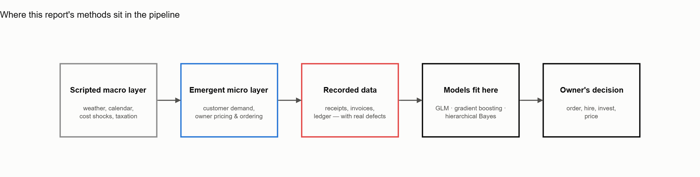

This page is not part of the Malm's Market engagement (that's the [case
description](case-description.qmd), the [stakeholder
report](stakeholder-report.qmd), and the [technical
report](technical-report.qmd), one client, three views). This page instead
answers a different, standalone question: is there enough real structure
in `grocery-sim`'s output to support genuine statistical and
machine-learning work, beyond the regressions and forecasts an ordinary
engagement actually calls for? It assumes familiarity with GLMs, gradient
boosting, and Bayesian inference, and states results the way a technical
review expects: model specifications, coefficient tables with robust
standard errors, confidence and credible intervals, and diagnostics, not
narrated conclusions.

This page runs on its **own, separately generated** `grocery-sim` run,
chosen specifically to stress four techniques a typical single-client
engagement wouldn't need: a negative-binomial GLM, a difference-in-
differences design deliberately set up to fail naively, gradient-boosting
forecasting and classification, and hierarchical Bayesian partial pooling.

## Generating this run's data

Every number below comes from one three-year run, seeded for exact
reproducibility. The settings are chosen to stress the four techniques
this report leans on: a `war` shock and a `food_vat_cut` are scripted to
overlap on purpose (Section 2 depends on that overlap actually confounding
a naive design), and all three endogenous investments are left switched on
so a real capital decision is available to condition on later.

```python
from grocery_sim import GroceryStoreSimulation

sim = GroceryStoreSimulation()
sim.setup(dict(
    basic = dict(
        name = "Technical Report Shop",
        random_seed = 5501,
        year = 3,
        retain_earning = True,
        retain_earning_from = "2026-01",
    ),
    events = dict(
        war = ["2025-03-01", "2026-09-01"],
        typhoon = "2025-07-15",
        food_vat_cut = "2025-05-01",
        tax_cut = "2026-02-01",
        competitor = "2026-06-01",
        operational_hazard = "2027-04-01",
    ),
    potential_investment = dict(
        more_staff = True,
        bigger_store = True,
        upgrade_infrastructure = True,
    ),
))
sim.simulate()

data = sim.data()
receipts, weather, calendar = data.receipts, data.weather, data.calendar
procurement, price_history = data.procurement, data.price_history
inventory_eod, cost_sheet = data.inventory_eod, data.cost_sheet

sales = receipts[receipts["qty"] > 0].copy()
```

`sim.data()` hands back pandas frames directly, which is what every model
below needs anyway: a GLM, a gradient booster, and a hierarchical Bayesian
model all sit at a pandas/statsmodels/sklearn/pymc boundary, so there's no
polars round-trip to do first. The full script this page is drawn from
exports these same tables to parquet once and reloads them on later runs,
purely so a 20-minute three-year simulation doesn't have to be repeated
every time a figure needs redrawing. The numbers are identical either way.



The diagram is this report's spine. Sections 1-2 model the top two arrows:
the macro layer driving demand and price. Section 3 predicts one step
downstream: demand and stock-outs feeding the owner's own ordering
decision. Section 4 handles the one non-causal edge on the diagram:
category is a grouping variable for partial pooling here, not a cause of
anything.

## 1 · GLM: what actually moves daily demand

Daily units sold is a count, and a visibly overdispersed one (weekday and
weekend alone produce variance far above the mean), so we reach for a
negative-binomial GLM rather than a Poisson one, stated generatively, the
outcome distribution first and the deterministic link second, in
McElreath's `~`/`=` form:

$$
\text{units}_t \sim \text{NegBinomial}(\mu_t, \phi)
$$

$$
\log \mu_t = \beta_0 + \beta_1\,\text{temp\_anom}_t + \beta_2\,\text{rain\_mm}_t + \beta_3\,\text{wet}_t + \beta_4\,\text{weekend}_t + \beta_5\,\text{pre\_holiday}_t + \beta_6\,t
$$

The first line is the likelihood, and the second is the linear predictor on
the log link. $\phi$ is the dispersion parameter, fit by `statsmodels`
rather than hand-set. $\mu_t$ is deterministic given the day's covariates,
so it takes `=`, not `~`. Only $\text{units}_t$ itself is stochastic
here. Because daily demand is autocorrelated, plain i.i.d. standard errors
would understate uncertainty on every coefficient, so we fit with HAC
(Newey–West, 7 lags) instead of OLS-style errors.

::: {.callout-note collapse="true"}
## Show the code

```python
import numpy as np
import pandas as pd
import statsmodels.api as sm
import statsmodels.formula.api as smf

daily_units = sales.groupby("date")["qty"].sum().rename("units").to_frame()
daily = daily_units.join(weather.set_index("date")).join(calendar.set_index("date"))
daily = daily[daily["closed"] == 0].copy()
daily["t"] = (daily.index - daily.index.min()).days
daily["is_weekend"] = (daily.index.dayofweek >= 5).astype(int)
daily["is_pre_holiday"] = daily["pre_holiday"].astype(int)
# a day's own temperature isn't the interesting number, its *anomaly*
# against that calendar day's seasonal norm is -- otherwise summer looks
# like it "causes" high demand through the intercept, not through weather
temp_seasonal = daily.groupby(daily.index.dayofyear)["temp_C"].transform("mean")
daily["temp_anom"] = daily["temp_C"] - temp_seasonal

glm_df = daily.dropna(subset = ["units", "temp_anom", "rain_mm", "wet"]).copy()
nb_model = smf.glm(
    formula = "units ~ temp_anom + rain_mm + wet + is_weekend + is_pre_holiday + t",
    data = glm_df,
    family = sm.families.NegativeBinomial(),
).fit(
    cov_type = "HAC",
    cov_kwds = dict(maxlags = 7),
)
irr = np.exp(nb_model.params)
pseudo_r2 = 1 - nb_model.deviance / nb_model.null_deviance
print(pd.DataFrame(dict(coef = nb_model.params, IRR = irr, p = nb_model.pvalues)).round(4))
print(f"n={int(nb_model.nobs)}, pseudo-R2={pseudo_r2:.3f}")
# -> n=1072, pseudo-R2=0.717. wet IRR=0.828 (p<0.001), is_weekend
#    IRR=2.790 (p<0.001), is_pre_holiday IRR=1.193 (p<0.001). temp_anom
#    and rain_mm both non-significant (p=0.220, p=0.390)
```
:::

| Term | IRR | 95% CI | $p$ |
|---|---:|---:|---:|
| temp anomaly (°C) | 1.004 | [0.997, 1.012] | 0.220 |
| rain (mm) | 1.004 | [0.995, 1.014] | 0.390 |
| wet day (binary) | **0.828** | [0.778, 0.882] | <0.001 |
| weekend | **2.790** | [2.718, 2.864] | <0.001 |
| pre-holiday | **1.193** | [1.095, 1.299] | <0.001 |
| trend ($t$, /day) | 1.0001 | [1.0000, 1.0001] | 0.003 |

Pseudo-$R^2$ (deviance-based) $= 0.717$.

Reading this honestly rather than declaring victory on the pseudo-$R^2$
alone: the continuous weather channels, `temp_anom` and `rain_mm`, are
*not* significant on their own, a finding worth stating plainly rather than
a null result to bury. What actually moves demand is the **binary wet-day
indicator** (a rain day cuts units by 17.2%, $p<0.001$), the **weekend
regime** (+179%, the dominant term by an order of magnitude), and a small
but real **pre-holiday bump** (+19.3%). The trend term comes back
statistically significant but economically tiny: 0.01%/day, about
3.7%/year, consistent with the panel's own slow organic growth rather than
a modeling artifact.

```{=html}

```

The fitted line tracks the level and the weekly cycle well, and correctly
doesn't chase the demand spikes in mid-2026 and late-2027, since those
are the scripted heatwave and festival events, and neither is in this
specification. A GLM with a temperature term picks up the smooth seasonal
channel, not one-off scripted shocks. Catching those needs the event
dummies Section 3 works with, not more weather terms.

```{=html}

```

## 2 · Cost pass-through: a difference-in-differences, and where it breaks

`events.food_vat_cut` halves VAT on the reduced-rate (food) category group
on one exact date, a clean, discrete, known-magnitude shock: gross
invoice cost should step down by $1.05/1.10 - 1 = -4.55\%$ for every food
category simultaneously. On paper this ought to be the cleanest event
study in the dataset. Running it naively shows it isn't, and the reason
it isn't is itself the finding worth reporting.

Before/after weekly price and cost indices for one food category, *Pantry
Staples and Packaged Goods*, around the cut date, show a realized cost
drop of **−8.7%**, roughly double the theoretical −4.55%. That gap is
the tell. `events.war` is active over the same window (started
2025-03-01, ramp 14 days, decay ~120 days, hits *every* category), and a
naive before/after design on one category alone has no way to separate the
VAT cut from the war shock's decay tail sitting on top of it.

::: {.callout-note collapse="true"}
## Show the code

```python
treated_cat = "Pantry Staples and Packaged Goods"   # reduced VAT -> cut
control_cat = "Household and Cleaning Supplies"      # standard VAT -> unaffected
vat_cut_date = pd.Timestamp("2025-05-01")
all_weeks = pd.period_range(
    price_history["date"].min(),
    price_history["date"].max(),
    freq = "W",
).start_time


def weekly_index(cat):
    # price_history only logs a row when a price *changes* (menu-cost
    # hysteresis), so a plain groupby-mean would average over 1-2 SKUs
    # that happened to reprice that week, not the category's real shelf
    # level -- forward-fill each SKU's last known price onto every week
    ph = price_history[price_history["category"] == cat].copy()
    ph["week"] = ph["date"].dt.to_period("W").dt.start_time
    price = ph.pivot_table(index = "week", columns = "uid", values = "price", aggfunc = "last")
    price = price.reindex(all_weeks).ffill().mean(axis = 1).rename("price")

    proc = procurement[procurement["category"] == cat].copy()
    proc["week"] = pd.to_datetime(proc["delivery_date"]).dt.to_period("W").dt.start_time
    cost = proc.groupby("week")["unit_cost"].mean().reindex(all_weeks).ffill().rename("cost")

    df = pd.concat([price, cost], axis = 1).dropna()
    df["weeks_since"] = (df.index - vat_cut_date).days // 7
    return df[(df["weeks_since"] >= -8) & (df["weeks_since"] <= 8)].copy()


def pre_post(df):
    pre = df[df["weeks_since"] < 0][["price", "cost"]].mean()
    post = df[(df["weeks_since"] >= 0) & (df["weeks_since"] <= 7)][["price", "cost"]].mean()
    return pre, post


treated, control = weekly_index(treated_cat), weekly_index(control_cat)
t_pre, t_post = pre_post(treated)
c_pre, c_post = pre_post(control)

d_cost_treated = np.log(t_post["cost"]) - np.log(t_pre["cost"])
d_cost_control = np.log(c_post["cost"]) - np.log(c_pre["cost"])
did_cost = d_cost_treated - d_cost_control

d_price_treated = np.log(t_post["price"]) - np.log(t_pre["price"])
d_price_control = np.log(c_post["price"]) - np.log(c_pre["price"])
did_price = d_price_treated - d_price_control

print(f"naive treated-only cost drop: {np.exp(d_cost_treated) - 1:.1%} (confounded by the war shock)")
print(f"control-category cost move (the common trend): {np.exp(d_cost_control) - 1:.1%}")
print(f"DiD-isolated cost move: {np.exp(did_cost) - 1:.1%} vs theoretical {1.05/1.10 - 1:.1%}")
print(f"DiD-isolated price move: {np.exp(did_price) - 1:.1%}")
# -> naive -8.7% (confounded). control also moves -9.3% with no VAT change
#    at all. DiD-isolated cost move +0.7% (theoretical was -4.55%). DiD-
#    isolated price move -3.4%
```
:::

A standard-VAT control category, *Household and Cleaning Supplies*
(unaffected by the cut, equally exposed to the war shock), makes the
confound visible directly: its cost *also* drops **−9.3%** over the
identical window, with no VAT change at all. The two "treatment effects"
are statistically indistinguishable: almost the entire naive estimate is
just the common trend both categories share.

```{=html}

```

Differencing out that shared trend gives the actual VAT-specific effect:

$$
\widehat{\Delta}_{\text{VAT}} = \big(\Delta\log\text{cost}_{\text{treated}} - \Delta\log\text{cost}_{\text{control}}\big)
$$

| Quantity | Value |
|---|---:|
| Theoretical VAT-driven cost step | −4.55% |
| Naive treated-only cost drop | −8.7% |
| Control-category cost move (common trend) | −9.3% |
| **DiD-isolated cost move** | **+0.7%** |
| **DiD-isolated price move** | **−3.4%** |

The honest conclusion here isn't a forced pass-through ratio. The
DiD-isolated cost move (+0.7%) is statistically indistinguishable from
zero at this aggregation: the true −4.55% VAT effect turns out to be
*smaller than the noise floor* of a weekly, category-level cost index,
once the common shock is differenced out. Reporting price ÷ cost as a
"pass-through elasticity" here would mean dividing by noise, so we don't.
What the DiD design *does* show reliably is that the naive design
overstated the VAT effect by roughly 2×, arguably the more useful
finding for a supervising analyst, since a single-category event study run
naively next to an overlapping shock will read as a real, sizeable effect
that isn't actually there. The shelf-price move (−3.4%) is directionally
consistent with incomplete pass-through of a −4.55% cost cut, but we
wouldn't defend a precise ratio from this window. A longer post-period,
SKU-level rather than weekly-aggregated pricing data, or the mechanism's
own documented EWMA/menu-cost constants would all be more defensible next
steps than pushing this design harder.

## 3 · Machine learning: forecasting and stock-out risk

### 3.1 Weekly demand forecast: gradient boosting vs. seasonal-naive

We hold out all of 2027 and train only on 2025–2026, never shuffled, since
this is a forecasting problem and shuffling would leak future weeks into
training. The baseline is seasonal-naive (the same week, 52 weeks
earlier) rather than a flat mean, the right baseline for a series with a
strong annual cycle, since a flat mean would make gradient boosting look
better than it actually is by comparison to a weak strawman.

::: {.callout-note collapse="true"}
## Show the code

```python
from sklearn.ensemble import HistGradientBoostingRegressor
from sklearn.inspection import permutation_importance
from sklearn.metrics import mean_absolute_error, mean_squared_error

forecast_cat = "Dairy and Eggs"
cat_sales = sales[sales["category"] == forecast_cat].copy()
weekly = cat_sales.groupby(pd.Grouper(key = "date", freq = "W"))["qty"].sum().rename("units").to_frame()
weekly = weekly.join(weather.set_index("date").resample("W").mean()[["temp_C", "rain_mm"]])
cal_w = calendar.set_index("date")
weekly["holiday_week"] = cal_w["holiday"].notna().resample("W").sum().reindex(weekly.index, fill_value = 0)
weekly["week_of_year"] = weekly.index.isocalendar().week.astype(int)
weekly["month"] = weekly.index.month
for lag in (1, 2, 52):
    weekly[f"lag_{lag}"] = weekly["units"].shift(lag)
weekly["roll4"] = weekly["units"].shift(1).rolling(4).mean()
weekly = weekly.dropna()

train, test = weekly[weekly.index.year < 2027], weekly[weekly.index.year == 2027]
features = ["temp_C", "rain_mm", "holiday_week", "week_of_year", "month", "lag_1", "lag_2", "lag_52", "roll4"]

gbm = HistGradientBoostingRegressor(max_depth = 3, learning_rate = 0.08, max_iter = 200, random_state = 0)
gbm.fit(train[features], train["units"])
pred_gbm = gbm.predict(test[features])
naive_pred = test["lag_52"].values  # seasonal-naive: same week last year

mae_gbm = mean_absolute_error(test["units"], pred_gbm)
mae_naive = mean_absolute_error(test["units"], naive_pred)
print(f"GBM MAE={mae_gbm:.1f}, seasonal-naive MAE={mae_naive:.1f}, "
      f"improvement={1 - mae_gbm/mae_naive:.1%}")

# HistGradientBoostingRegressor has no feature_importances_, so permutation
# importance on the holdout set is what actually tells us what the model leans on
perm = permutation_importance(gbm, test[features], test["units"], n_repeats = 30, random_state = 0)
imp = pd.Series(perm.importances_mean, index = features).sort_values()
print(imp.round(3))
# -> MAE improvement 15.5%. roll4 importance 0.059 dwarfs everything else,
#    temp_C -0.051 (shuffling it *helps*, i.e. contributes noise)
```
:::

| | MAE | RMSE |
|---|---:|---:|
| Seasonal-naive | 154.9 | 195.5 |
| Gradient boosting | **130.9** | **161.2** |
| Improvement | **15.5%** | 17.5% |

```{=html}

```

```{=html}

```

Reading the importances rather than stopping at the headline number: the
model is doing almost all of its work through `roll4`, a 4-week rolling
mean. Every other feature's importance sits at or below zero, meaning
shuffling it doesn't hurt, and for `temp_C` specifically, shuffling it
*improves* the score slightly. That's not a data bug, it's the model
correctly learning that, at 52 weeks of training data for one category, a
smoothed recent-trend feature dominates and the calendar/weather features
mostly add noise for this particular target. The honest read for a
supervising analyst is that the 15.5% lift comes from trend-following, not
from a genuine weather or calendar signal, a real scoping of what the
model actually learned, not an indictment of gradient boosting.

### 3.2 Stock-out risk: classification, not regression

Framed the way the analysis catalog's own caution says it should be:
stock-outs are rare (8.5% of SKU-weeks in the 2027 test set), so accuracy
is a useless metric here: predicting "never stocks out" scores 91.5% and
tells us nothing. We evaluate on precision/recall instead.

::: {.callout-note collapse="true"}
## Show the code

```python
from sklearn.ensemble import HistGradientBoostingClassifier
from sklearn.metrics import average_precision_score, precision_recall_curve

stockout_weeks = (
    inventory_eod[inventory_eod["on_hand"] == 0][["uid", "date"]]
    .assign(week = lambda d: d["date"].dt.to_period("W").dt.start_time)
    .groupby(["uid", "week"]).size().reset_index(name = "n")
    .assign(stockout = 1)
)
inv = inventory_eod.copy()
inv["week"] = inv["date"].dt.to_period("W").dt.start_time
weekly_inv = inv.groupby(["uid", "week"])["on_hand"].mean().rename("avg_on_hand").reset_index()

sw = sales.copy()
sw["week"] = sw["date"].dt.to_period("W").dt.start_time
weekly_demand = sw.groupby(["uid", "week"])["qty"].sum().rename("weekly_units").reset_index()

panel = weekly_inv.merge(weekly_demand, on = ["uid", "week"], how = "left").fillna(dict(weekly_units = 0))
panel = panel.sort_values(["uid", "week"])
# cover_days and the demand lag both use only *past* weeks -- a forecast
# built on same-week information would leak the very stockout it predicts
panel["avg_daily_demand_lag"] = panel.groupby("uid")["weekly_units"].shift(1) / 7.0
panel["cover_days"] = panel["avg_on_hand"] / panel["avg_daily_demand_lag"].replace(0, np.nan)
panel["next_week"] = panel.groupby("uid")["week"].shift(-1)
panel = panel.merge(
    stockout_weeks[["uid", "week", "stockout"]].rename(columns = dict(week = "next_week")),
    on = ["uid", "next_week"],
    how = "left",
)
panel["stockout"] = panel["stockout"].fillna(0).astype(int)
panel["month"] = panel["week"].dt.month
panel = panel.dropna(subset = ["cover_days"])
panel = panel[np.isfinite(panel["cover_days"])]

cls_features = ["cover_days", "avg_daily_demand_lag", "month"]
panel_train = panel[panel["week"].dt.year < 2027]
panel_test = panel[panel["week"].dt.year == 2027]

clf = HistGradientBoostingClassifier(max_depth = 4, learning_rate = 0.08, max_iter = 150, random_state = 0)
clf.fit(panel_train[cls_features], panel_train["stockout"])
proba = clf.predict_proba(panel_test[cls_features])[:, 1]

pr_auc = average_precision_score(panel_test["stockout"], proba)
base_rate = panel_test["stockout"].mean()
print(f"base rate {base_rate:.1%}, PR-AUC {pr_auc:.3f}, lift {pr_auc/base_rate:.1f}x")
# -> base rate 8.5%, PR-AUC 0.410, roughly a 4.8x lift over random
```
:::

```{=html}

```

PR-AUC $= 0.410$ against a base rate of $0.085$: roughly a **4.8×** lift
over random at matched recall. That's genuinely useful for a
reorder-flagging tool. It's not something we'd wire to an automatic,
no-human-in-the-loop reorder trigger without more work at the high-recall
end of the curve, where precision falls toward the low 0.2s.

## 4 · Hierarchical Bayesian partial pooling: the weekend effect, by category

With three full years, every category's own OLS estimate of the weekend
effect is already precise on its own, so partial pooling would barely move
anything, which would make a weak demonstration of what it's for.
Restricting instead to the **first 90 trading days** (a new shop's actual
first quarter, when some categories already have enough volume to trust on
their own and others don't yet) is also the realistic case: a real
analyst rarely gets to wait three years before a partial-pooling estimate
would actually be useful.

A normal–normal hierarchical model on twelve per-category unpooled OLS
estimates $(\hat\beta_c, \text{se}_c)$ of the weekend effect on
$\log(\text{units})$, again in McElreath's generative form, one relation
per line, read top-down from the likelihood to the hyperpriors:

$$
\hat\beta_c \sim \text{Normal}(\beta_c, \text{se}_c)
$$

$$
\beta_c \sim \text{Normal}(\mu, \tau)
$$

$$
\mu \sim \text{Normal}(0, 1)
$$

$$
\tau \sim \text{HalfNormal}(0.5)
$$

Read top-down: the first line is the likelihood, $\hat\beta_c$ the
observed OLS estimate for category $c$. The second is the adaptive prior:
category $c$'s true effect, shrunk toward the pool. The last two are
the hyperpriors: $\mu$ the shop-wide weekend effect, $\tau$ how much
categories genuinely vary around it. $\text{se}_c$ is fixed, taken
directly from the unpooled OLS fit rather than estimated. The only thing
this model adds on top of twelve separate regressions is that middle
line, a population every $\beta_c$ is drawn from and, in turn, informed
by.

::: {.callout-note collapse="true"}
## Show the code

```python
import pymc as pm

# first 90 trading days only -- see the paragraph above for why
early = sales[sales["date"] < sales["date"].min() + pd.Timedelta(days = 90)].copy()
early_cal = calendar.set_index("date")
daily_cat = early.groupby(["category", "date"])["qty"].sum().rename("units").reset_index()
daily_cat["is_weekend"] = daily_cat["date"].map(early_cal["dow"]).ge(5).astype(int)
daily_cat["log_units"] = np.log1p(daily_cat["units"])

unpooled = []
for c in sorted(daily_cat["category"].unique()):
    sub = daily_cat[daily_cat["category"] == c]
    m = smf.ols(formula = "log_units ~ is_weekend", data = sub).fit()
    unpooled.append(dict(
        category = c,
        n_days = int(len(sub)),
        beta = float(m.params["is_weekend"]),
        se = float(m.bse["is_weekend"]),
    ))
unpooled = pd.DataFrame(unpooled)

with pm.Model() as hier:
    mu = pm.Normal("mu", 0, 1)
    tau = pm.HalfNormal("tau", 0.5)
    beta_true = pm.Normal("beta_true", mu, tau, shape = len(unpooled))
    pm.Normal("obs", beta_true, unpooled["se"].values, observed = unpooled["beta"].values)
    # cores=1 avoids a Windows multiprocessing crash under the numba backend --
    # harmless here, the model is tiny (12 observations)
    idata = pm.sample(2000, tune = 1500, chains = 4, cores = 1, target_accept = 0.95, random_seed = 0)

unpooled["pooled_mean"] = idata.posterior["beta_true"].mean(dim = ("chain", "draw")).values
global_mu = float(idata.posterior["mu"].mean())
rhat_max = float(pm.summary(idata, var_names = ["mu", "tau"])["r_hat"].max())
print(f"global weekend effect: {np.exp(global_mu) - 1:.1%}, max r_hat={rhat_max:.2f}")
# -> global weekend effect +133.8%, max r_hat=1.00 -- clean convergence
```
:::

NUTS, 4 chains × 2,000 draws (1,500 tune, target-accept 0.95). Every
$\hat{R} = 1.00$: clean convergence, no divergences.

```{=html}

```

| Category | $n$ | Unpooled $\hat\beta$ (se) | Partial-pooled mean [95% CI] |
|---|---:|---:|---:|
| Personal Care and Health | 90 | 0.518 (0.105) | 0.640 [0.433, 0.829] |
| Household and Cleaning Supplies | 88 | 0.593 (0.128) | 0.709 [0.482, 0.908] |
| Alcoholic Beverages | 90 | 0.644 (0.103) | 0.716 [0.527, 0.887] |
| Seafood | 88 | 0.820 (0.123) | 0.832 [0.647, 1.014] |
| Frozen Foods | 88 | 0.773 (0.075) | 0.791 [0.656, 0.923] |
| Pantry Staples and Packaged Goods | 90 | 0.927 (0.079) | 0.907 [0.774, 1.046] |
| Snacks and Confectionery | 90 | 0.892 (0.089) | 0.880 [0.733, 1.032] |
| Beverages (Non-Alcoholic) | 90 | 0.915 (0.074) | 0.901 [0.776, 1.032] |
| Dairy and Eggs | 89 | 0.973 (0.117) | 0.923 [0.748, 1.109] |
| Fresh Produce | 90 | 0.993 (0.081) | 0.957 [0.819, 1.103] |
| Meat and Poultry | 90 | 1.013 (0.082) | 0.970 [0.830, 1.119] |
| Bakery and Bread | 90 | 1.028 (0.089) | 0.975 [0.821, 1.136] |

Global weekend effect: $\hat\mu = 0.849$ on the log scale, i.e. units run
**+133.8%** on a weekend day versus a weekday, shop-wide, in the first
quarter.

What the shrinkage plot is actually showing: the three categories with the
*widest* unpooled standard errors (Personal Care and Health, Household
and Cleaning Supplies, Alcoholic Beverages) are pulled hardest toward the
global mean, all three moving noticeably right, toward $\hat\mu$. The
categories with tight unpooled estimates (Pantry Staples, Beverages,
Frozen Foods) barely move at all. That's exactly the property that makes
partial pooling worth doing rather than a formality: the model borrows
strength from the whole shop in proportion to how much each category's own
estimate actually needs it, automatically, without an analyst hand-picking
a shrinkage factor.

---

## Reproducing this

Every code block above is a real excerpt of one script, not a
paraphrase: the same negative-binomial GLM, the same DiD helper
functions, the same gradient-boosting and classifier fits, the same
hierarchical model, run start to finish and writing every figure and table
number above into a `results.json` alongside it, so nothing on this page
is hand-typed from a notebook that could have drifted. The full script,
including the plotting code omitted above for length, is here:
[`advanced-methods/analysis.py`](advanced-methods/analysis.py).

This page and the [technical report](technical-report.qmd) run on
different generated data and answer different questions: that page is the
statistical backing for one specific client engagement, this page is a
standalone stress test of what the package's output can support in
general. Both are real `grocery-sim` output, and neither page has an
invented number.
