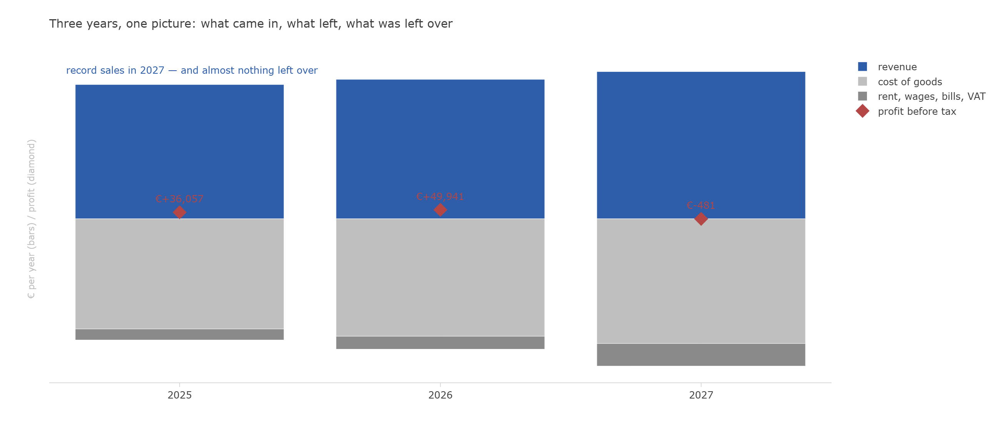
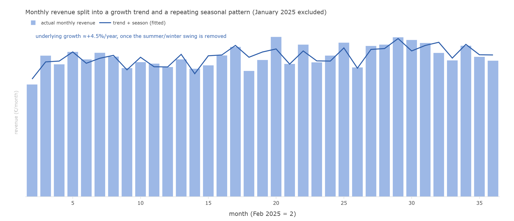
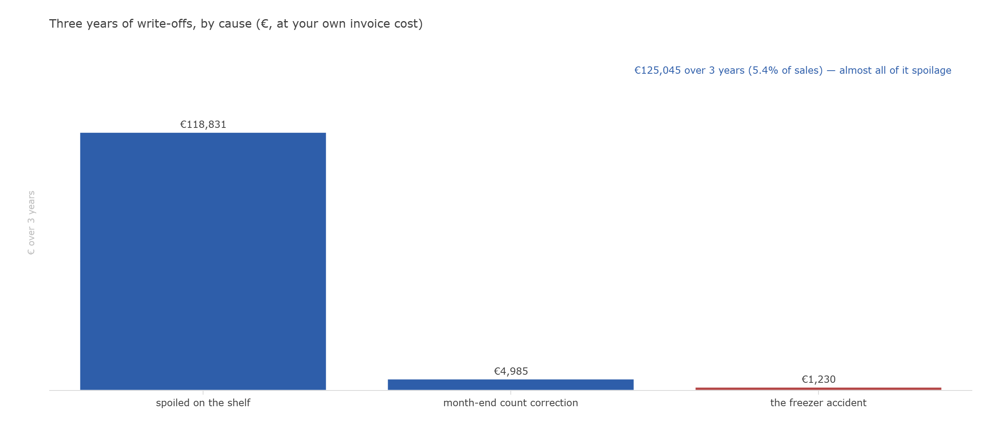
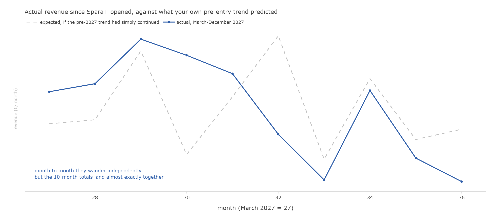
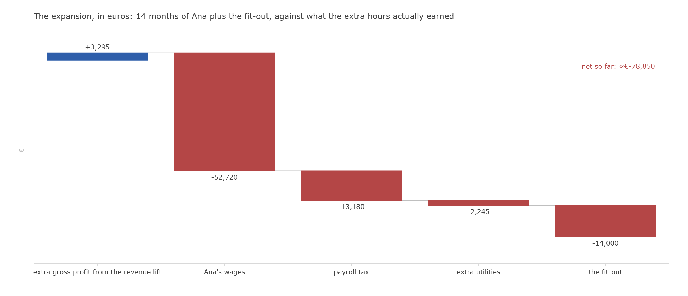
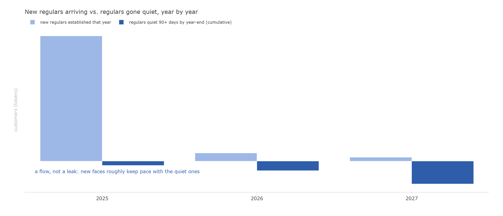
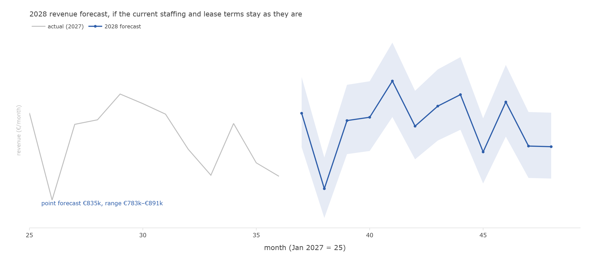

This page reproduces one complete `grocery-sim` engagement end to end: the
client-facing case brief exactly as an analyst would receive it, and the
resulting report, answering the client's own questions in the order he asked
them. Both are real artifacts from the `3y_baseline` scenario arm
([`cases/3y_baseline/`](https://github.com/ChinhMaiGit/grocery-sim/tree/main/cases/3y_baseline)
in the repository) — nothing here is invented for the site. The full,
cell-by-cell working behind every number in the analysis lives in
[`analysis_notebook.py`](https://github.com/ChinhMaiGit/grocery-sim/blob/main/cases/3y_baseline/analysis_notebook.py),
a [marimo](https://marimo.io/) notebook.

Per the project's own [epistemic firewall](https://github.com/ChinhMaiGit/grocery-sim/blob/main/documents/CASE_WRITING_GUIDE.md):
the brief below is written entirely from what the shop's owner actually
lived through and handed over — nothing in it uses the hidden generating
mechanism. The analysis that follows uses only the same data the brief
describes.

::: {.callout-note collapse="false"}
## Note on scale

The pages below are long by design — the whole point of a gradeable case is
that a claim like "I can't find a measurable dent from the competitor" is
checked, not asserted. Skip to whichever section answers the question you
came for.
:::

# Part 1 — The engagement brief

*Client: Henrik Malm, owner, Malm's Market, Kastanjegatan 7, Lindåker.
Engagement window: January–February 2028. Decision deadline: the lease
answer is due to the landlord by **28 February 2028**.*

*You have been retained as an independent analyst. This packet contains the
client's letter, the notes from the intake interview, a description of the
data he has handed over, and the questions he wants answered. The data
accompanying this brief is generated by `grocery-sim` under
`basic.year = 3` (the arm is named `3y_baseline` in the repository).*

## 1 · The letter

> Dear analyst,
>
> Three years ago I opened a grocery shop, and by every measure I
> understood at the time, it worked. More people shop with us every year.
> The last year was our best ever at the till — over eight hundred
> thousand euros through the register. And after paying for everything, I
> personally earned almost exactly **nothing**. A few hundred euros in the
> red, if you want the truth of it.
>
> I think I know the reason, and it has a name: **Spara+**, the discount
> chain that opened a store six hundred meters from my door last March.
> Everything was fine until then. Since March I have watched my own
> customers walk past my window with their yellow bags. I cut my prices on
> the shelves they advertise hardest — drinks, snacks, cleaning things —
> and it still wasn't enough.
>
> My lease expired on New Year's Eve. The landlord will hold the current
> terms for a new two-year lease, but he wants my answer by the end of
> February. Two more years of rent is a serious promise for a shop that
> just earned nothing, next to a competitor with a marketing budget bigger
> than my revenue.
>
> Before I sign — or don't — I want someone who isn't me to look at my
> numbers properly. I have kept everything: every receipt line, every
> delivery paper, every price change, every month's books. My records are
> not perfect — I'll tell you honestly where they wobble — but they are
> complete, and my monthly ledger is right to the cent, because I do it
> myself and I check it.
>
> Tell me what the numbers actually say. If the answer is "close", I would
> rather hear it from you now than from my accountant in two years.
>
> — Henrik Malm

## 2 · Intake interview notes

*Recorded at the shop, 9 January 2028, after closing. Lightly edited.
H = Henrik Malm; Q = analyst.*

**Q: Tell me about yourself and how the shop started.**

H: I'm 52. I spent twenty-four years running other people's supermarkets
for the Fylkia chain — shift lead, then store manager. I know how a shop
breathes. In 2024 I decided that if I was ever going to run my own, it was
then. I had **€40,000** saved. I spent most of a year scouting locations —
I still have my notes comparing eight candidate sites: the rents, the
fit-out costs, how much shelf space each could hold; I'll give you those
too — and took the one on Kastanjegatan. Not the cheapest, not the busiest. A proper neighborhood:
a few hundred households, schools, people who live here for decades. And
renters, who don't. We opened the second of January, 2025.

**Q: What kind of shop is it?**

H: A full grocery, small format. About 130 products on the shelves at any
time across everything — produce, bakery, dairy, meat, fish, frozen,
drinks, dry goods, snacks, household, personal care, beer and wine. I
carry the premium brand and the cheap one side by side, because a
neighborhood shop serves the whole neighborhood. We are not a kiosk and
we are not a discounter. People come because we are two minutes away and
we have what they need — that is the business.

**Q: Walk me through the routine.**

H: Same since day one. Open every day of the year except New Year's Day
and Christmas Day. Eight to eight originally; since November 2026 it's
**seven to nine**. Deliveries come every **Wednesday**, one truck, from
Nordgros — I have used one wholesaler from the start, it keeps the
paperwork sane. I do prices myself with the label gun, and I only bother
when a price has genuinely drifted — you'll see in my price file that most
tags barely move. End of every month I count the stock, all of it, myself.
And the last Sunday of every month is our little tradition: **five percent
off everything**, since opening. People know it; those Sundays are busier.

**Q: The first year — 2025 — how was it?**

H: Better than my plan, honestly. The first month was wild — everyone in
the neighborhood came to try us, and they were filling pantries, not
shopping normally. Cleaning supplies, shampoo, spirits — things people buy
in January and then not again for months. I nearly mis-ordered on that
signal before I understood it. Then it settled into a rhythm. The autumn
was rough on costs — the energy crisis, you'll remember; my electricity
bill went mad in the last quarter and my suppliers' fridge goods crept up
too. We still finished the year around **seven hundred forty thousand** in
sales and I lived off the shop. I didn't pay myself a salary that first
year — I lived on my savings and left every euro inside.

**Q: And 2026?**

H: The good year — though it didn't start that way. In February the
freezer compressor died overnight. I opened the door at seven and threw
the entire frozen aisle and half the dairy case into the bin. **€1,800**
for the repair, plus all that stock, and three weeks of running the frozen
section half empty while the engineer waited for parts. But the rest of
the year was strong. The summer was brutal — a heatwave like I don't
remember; ice cream flew out the door and my produce spoiled faster than
I could rotate it. In September the new apartment building across the
street finally filled up — you could feel the new faces week by week.
From January that year I had started paying myself properly and putting
half of every good month aside, and by autumn the set-aside crossed the
line I had promised myself. So in **November 2026** I did the expansion:
hired Ana — eight-hour shifts, my first employee ever — extended hours to
seven-to-nine, and rebuilt the shelving for deeper stock. Cost me
**€14,000** in fittings, all saved, no loan. December 2026 was the best
month the shop ever had. I was proud of that year.

**Q: Then 2027.**

H: (long pause) Everything got heavier at once. The rent review kicked in
from January — my lease had a review after two years, and it went from
**€1,160.66** to **€1,299.94** a month, twelve percent. Fine, it's the
contract. Then in **March, Spara+ opened**. Six hundred meters away,
yellow signs, national advertising. From May I fought back — I cut my
margin about four points on drinks, snacks, and household goods, the
shelves they scream about. In August we had two lovely weeks — the town
moved the street festival onto our street and the shop was full of
strangers. In the autumn, dry goods and flour-type staples got expensive
again for a couple of months — suppliers said world prices. We ended the
year at over **eight hundred ten thousand** in sales. Record. And the
bottom line was a few hundred euros *below* zero. I paid Ana, I paid the
landlord, I paid the taxman — everyone got paid except me.

**Q: What do you think happened?**

H: Spara+. I don't need a consultant to see it — walk outside. Everything
in this shop worked until March 2027 and after March 2027 I earn nothing.
My worry is that this street is now a discounter's street, and two more
years of lease is just two more years of feeding the landlord while
Spara+ finishes the job. That's what I want you to check with the numbers
— not whether I'm losing to them, I can see that — but whether it's
already fatal.

**Q: Anything I should know about the records before I start?**

H: Yes, be careful with three things. First, the **POS terminal is old**
— it has re-uploaded whole receipts before; my card processor swears they
fix it, but I have found doubles in the past and I doubt I found them
all. Second, the **month-end count never quite matches** what the books
say should be on the shelf — every retailer knows this, we write off the
difference, but you should know the book stock drifts. Third, some
**delivery paperwork never got typed in** — there were weeks I was alone
and exhausted, and I paid Nordgros for goods you will not find an invoice
line for. My ledger is still right — I book from the bank account, not
from the paper — but the invoice file has holes. Oh, and the little
weather station on the roof — I log temperature and rain because weather
moves my trade — it goes dark for a few days now and then.

**Q: What does a useful answer look like to you?**

H: Pages I can read. A number where you tell me how sure you are. And
don't be polite: if I did something wrong, I want it in the first
paragraph, not the last.

## 3 · The data

Henrik provides complete records for 1 January 2025 through 31 December
2027, as exported from his systems:

| File | What it is |
|---|---|
| `receipts.csv` | every till line: date, hour, product, quantity, unit price, payment type, a promo flag; card payments carry the terminal's anonymized customer code; returns reference the original receipt |
| `price_history.csv` | every shelf-tag change per product |
| `promotions.csv` | his markdown campaigns (dates, depth, category) |
| `procurement.csv` | Nordgros invoice lines: order/delivery/posted dates, quantity, unit cost |
| `inventory_eod.csv` | end-of-day *book* stock per product |
| `write_offs.csv` | everything binned, with a reason (spoilage, the monthly count correction, the freezer accident) |
| `cost_sheet.csv` | **his monthly ledger — authoritative for money**: revenue, procurement, rent, wages, utilities, VAT remitted, plus his savings ledger, own draws, the fit-out spend, and tax payments |
| `tax_statement.csv` | the three annual filings |
| `calendar.csv`, `weather.csv` | trading calendar; the roof station's temperature and rain log |
| `locations.csv` | his 2024 site-scouting notes (the eight candidate sites) |
| `SKUs.xlsx` | the product catalog: category, brand tier, base prices |

He estimates roughly 60% of payments are by card. Cash customers are
anonymous by nature; card codes are stable but pseudonymous.

## 4 · The questions

Henrik's questions, in his words, in the order he asked them. He expects
each answer as something he can read, with your confidence stated.

1. **"Show me where the money actually goes."** A picture of the three
   years — what comes in, what leaves, and where the profit went — that he
   can put on the wall.
2. **"Am I really growing, or does it just feel that way?"** Separate
   genuine growth from seasons and one-off events.
3. **"What is the shrinkage costing me — and should I be worried about
   theft?"** The month-end write-offs bother him more than he admits.
4. **"What did Spara+ actually cost me?"** A number, with your reasoning —
   he wants his conviction tested, not flattered.
5. **"Was the expansion worth it?"** Ana, the hours, the shelves, the
   €14,000 — he asks this one quietly.
6. **"Which customers am I losing, and who replaced them?"** He recognizes
   faces, not numbers; he wants the turnover of his neighborhood made
   visible.
7. **"What should I expect 2028 to look like?"** If nothing changes —
   ranges, not prophecy.
8. **"Renew, close, or change something — what do the numbers say?"** The
   answer he is paying for, due before 28 February.

## 5 · Stakes

If he signs, he commits to roughly **€31,200** of rent over two years
against a year that netted him nothing. If he walks away, he abandons a
shop with record revenue, a loyal core of regulars, and three years of his
life. He believes the decision hinges on Spara+. Your job is to find out
whether the numbers agree.

---

# Part 2 — The analysis

*Prepared for Henrik Malm by his independent analyst, February 2028. Every
number below is computed from the records he handed over — his receipts,
invoices, stock counts, and his own monthly ledger — and the full working,
cell by cell, sits alongside this report in
[`analysis_notebook.py`](https://github.com/ChinhMaiGit/grocery-sim/blob/main/cases/3y_baseline/analysis_notebook.py)
so anything below can be checked.*

The analysis answers Henrik's eight questions **in the order he asked
them**, on purpose — a case brief sets the terms of engagement, and an
analysis that reorders the client's own priorities to suit a cleaner
narrative has already started managing him rather than answering him.

## The one paragraph he asked for first

**You're right that 2027 went flat. You're wrong about why.** I can't
find a measurable dent from Spara+ anywhere in your top-line numbers —
revenue, units sold, and shopping trips all stayed right on the trend
they were already on before the discounter opened. What I *can* find,
priced to the euro from your own ledger, is that the second hire and the
extended hours you took on in November 2026 have cost roughly €82,000
against about €3,300 of extra gross profit so far. That gap — not the
competitor, not the rent review — is why a record sales year handed you
nothing. **Renew the lease. The lease was never the problem. The
staffing decision is.**

## 1 · Where the money actually goes

Revenue grew every year — €743.0k, €771.3k, €814.3k. So did the cost of
running the shop. What was left for you: **+€36,057 in 2025, +€49,941 in
2026 (your best year), and −€481 in 2027.** Your own account of it —
record sales, nothing left over — is exactly right.

Before charting any of this, I tied your cleaned till receipts to your
own monthly ledger, year by year. They match to within a few euros in
each year, and I tracked that residue down to a specific cause rather
than writing it off: two single receipts (one in 2025, one in 2026)
where the same product was rung up twice in two identical scans — a
genuine double-scan or a two-unit purchase split across two lines, not a
processing fault. Once named, the gap disappears entirely. **Confidence:
high.** Your ledger is right, and now I can show you exactly why the raw
till doesn't look like it agrees with it at first glance.

## 2 · Am I really growing, or does it just feel that way?

Both — and they're worth pulling apart. Once I remove the ordinary
summer-versus-winter swing (and set your opening month aside, since you
told me yourself it was pantry-filling, not normal trade), the
underlying growth rate is **roughly +4.5% a year.**

That growth is real, not an illusion of rising prices: units sold grew
about 6% from 2025 to 2027, while your average shelf price only drifted
about 3% over the same span. And it shows up mainly as **bigger baskets
per visit, not more visits** — the same core of customers trusting you
with more of their list each time, rather than a flood of new footfall.
**Confidence: high** on the trend estimate; the growth *composition*
(basket size over visit frequency) is a secondary read and slightly
less certain, but consistent across all three years.

## 3 · The shrinkage — and whether it's theft

Three years of write-offs come to **€125,045**, about 5.4% of sales —
and 95% of that is spoilage, the ordinary cost of running a full fresh
range, which crept up a little as your fresh volumes grew and through a
couple of hot summers. The freezer accident is exactly what you
described: one isolated event in February 2026, never repeated.

The month-end count corrections — the part that would show theft, if it
existed — total under €5,000 across three years, and I traced your
single largest correction month directly to a specific cause: that
month, four supplier invoices were posted to your books twice (same
product, quantity, and dates, entered on two different days), and those
duplicated lines alone account for most of that month's "missing" stock.
It was never on the shelf to begin with. **My verdict: no theft signal.**
Every correction I can trace, traces to paperwork. **Confidence: high**
on the decomposition and the "no theft" conclusion; the exact euro
split between ordinary counting noise and undiscovered duplicate
postings in the smaller months is closer to a well-informed estimate.

## 4 · What did Spara+ actually cost me?

This is the one where I have to slow down, because your instinct and my
job are not the same thing. I took only the eleven months of your own
history *before* Spara+ opened, fit your trend and season to it, and
asked what the rest of 2027 "should" have looked like if nothing new had
entered the picture. Then I compared that to what actually happened.

**The gap is essentially zero** — about €35 over ten months, against a
shop whose ordinary month-to-month wobble is far larger than that on its
own. Units sold and shopping trips tell the same story: both landed
almost exactly on the pre-entry trend, not below it.

I also tested the shelves you specifically cut prices on — drinks,
snacks, household goods — against everything else, controlling for the
same trend and season. The difference is small and not statistically
distinguishable from zero. That result cuts both ways: it doesn't clear
Spara+, because your own May 2027 price cut on exactly those shelves
means I can't tell "the competitor didn't hurt this category" apart from
"your price cut is masking that it did."

**My honest conclusion:** I cannot find a reliable, measurable dent from
Spara+ in your numbers. That is not the same as "it cost you nothing" —
a competitor six hundred metres away is certainly taking some trade, and
an effect of a few thousand euros in either direction would be invisible
to any method working from monthly totals. What I can say with
confidence is that it is **not large enough to explain why a record
revenue year netted almost nothing.** Section 5 is where that year's
result actually came from. **Confidence: medium-high** that the
top-line effect is small; I would not put a precise euro figure on it
beyond "smaller than a few thousand a year, and swamped by what's in
Section 5."

## 5 · Was the expansion worth it?

This one prices directly from your own ledger. Over the fourteen months
since November 2026: Ana's wages cost **€52,720**, payroll tax on top
another **€13,180**, the extended hours' share of the electricity bill
roughly **€2,245**, plus the **€14,000** fit-out — **€82,145 in total.**

Revenue did rise faster than your pre-expansion trend alone would
predict — about €20,000 extra over the period. But at your shop's
overall margin (about 16% after the cost of goods), that only turns into
**€3,295 of actual gross profit.** The mechanism is simple arithmetic: a
wage is a euro-for-euro cost every month, but a euro of extra revenue
only keeps about sixteen cents of margin — so covering Ana's wages and
payroll tax alone (€65,900) needs roughly **€404,000** of genuinely new
revenue, not the shop's existing turnover. The extended hours brought in
about €20,000 — roughly twenty times less than that. **Net so far:
approximately −€78,850.**

To be fair to the decision itself: November 2026 was your best month
ever, the freezer scare was behind you, and the money was genuinely
saved, not borrowed. Taking on help after a record year is a reasonable
read of the business at the time. The numbers say it hasn't paid for
itself yet — not that it was a foolish bet. **Confidence: high** on the
cost side (it comes straight from your ledger); **medium** on the
revenue-lift estimate, since it depends on the same trend-projection
method as Section 4, though the conclusion is not close enough to
change even at the edges of that uncertainty.

## 6 · Which customers am I losing, and who replaced them?

Card codes let me follow individual customers, anonymously, across three
years. **289 tokens** shop here often enough (at least 10 receipts
somewhere in three years) to call "regulars." By the end of 2027, **48 of
them** — about one in six — have gone quiet for 90 days or more.

That is real turnover, and I'm not going to bury it under the healthy
total. But it is a **flow, not a one-way leak**: your regular count still
grew net across the three years, because new households — plausibly
including some from the apartment building that filled up in 2026 — kept
becoming regulars faster than the old ones went quiet. One honest
caveat: a handful of the 48 who only went quiet in the last couple of
months of 2027 might simply be between visits when my data ends — I
can't yet tell a slow customer from a lost one at the very edge of the
window, so that count is probably a slight overstatement of true,
permanent departures. **Confidence: medium-high** on the flow story;
the precise year-end count carries the right-censoring caveat above.

## 7 · What should I expect 2028 to look like?

If nothing changes — same hours, same staffing, the lease renewed on the
terms on the table — my model (fitted on your own three years, and
noticeably more accurate on your recent months than simply repeating
last year's figures would have been) puts 2028 revenue at
**€835,000, with a realistic range of roughly €783,000 to €891,000.**

Converted to profit using 2027's own cost structure, that range comes
out to **roughly −€4,700 to +€9,900, centered near +€2,400.** In plain
terms: if nothing changes, 2028 looks like another 2027 — a coin flip
between a small profit and a small loss, not a rebound and not a
collapse. **Confidence: medium.** The revenue range is well-grounded;
the profit range additionally assumes next year's cost structure
resembles this year's, which is a reasonable but not certain
assumption.

## 8 · Renew, close, or change something?

| What changed in 2027 | Estimated effect on that year's profit |
| --- | --- |
| The rent review (contractual, +12% from January) | **−€1,671** |
| Spara+ opening in March | **no measurable effect** — real, almost certainly, but too small to find, and not the reason the year went flat |
| The November 2026 hire, in its first full year | **the dominant driver** — costing roughly €70,000 a year against the shop's thin margin |

**Renew the lease.** Twelve percent on a contract you already knew about,
in a shop growing 4.5% a year net of season, is not what turned €50,000
of profit into nothing. Walking away over a rent review you agreed to
going in — while the thing that actually explains the year is one you're
free to change — would be solving the wrong problem.

**Revisit the staffing decision, not the tenancy.** That doesn't have to
mean letting Ana go. Two honest options, both worth pricing properly
before you choose:

- Pull the hours back toward what they were, and keep Ana for the
  busiest shifts and the jobs that were piling up on you alone —
  cutting the payroll cost without giving up the help entirely.
- Keep the current hours, but treat this coming year as the one where
  you find out whether they can be made to pay — through what actually
  moves at 7am and 9pm, not a blanket extension.

**What I would not do** is fight Spara+ harder. Cutting margin further on
the shelves they advertise is a fight the numbers say you are not
currently losing, at a real cost to the margin you do have.

**One year ahead, if nothing changes:** a coin flip between a small
profit and a small loss, because the cost structure that produced 2027
carries straight into 2028 untouched. The lease decision and the
staffing decision are two different decisions — on this evidence, only
one of them needs to change.

---

## Reading this against the catalog

This single engagement touches most of the [Analysis catalog](../analysis-catalog.qmd)
in the order a real one would: §1 is Layer 1 (describe), §2 is Layer 7
(trend/season decomposition, only possible on three years), §3 is Layer 0
(cleaning) applied to shrinkage specifically, §4 and the staffing half of §5
are Layer 5 counterfactual reasoning done the honest, non-CRN way an analyst
without an answer key actually has to do it — an observational
before/after design, with its limits stated rather than hidden — §6 is
Layer 7's churn/panel question, §7 is Layer 3 (predict), and §8 is Layer 4
(prescribe), closing the loop back to the client's actual decision.

It's also a useful contrast with [Theory](../theory.qmd)'s CRN-twin
discussion: this report never gets to *know* the true effect of Spara+ the
way a scenario-twin comparison would — it has to estimate it from one
history, state its confidence, and say plainly where the method's limits
are. Grading this report against `grocery-sim`'s own hidden answer key (not
reproduced here) is itself one of the catalog's Layer-5 exercises: how close
does an honest observational analysis get to the truth a twin arm would
hand you for free?
